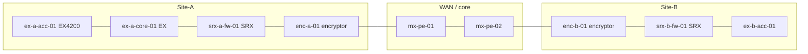

# Networking — Track Overview

> **Track status:** active path — intern operations on **older Juniper** gear.  
> **Lab standard:** physical or virtual **Junos** devices (EX / SRX / PE), not Cisco Packet Tracer and not Docker as the default.  
> **Classification:** unclassified lab only. No real keying material, no production credentials, no classified topologies in course repos.

## Learning outcomes

After this overview you can:

- Explain why **networking** is a selection-relevant craft on CISS-type systems  
- Name the **Juniper platform families** this track uses (older EX, older SRX, MPLS PE)  
- Navigate the **module path** from **general networking** → addressing → Junos → switch → firewall → OSPF/BGP → MPLS → encryptors → change/troubleshooting  
- Relate network work to **interfaces / ICDs**, **NFRs** (latency, availability), and **Military** voice/datalink paths  

## Why this track exists

Software and sensors only matter if packets **arrive, in order, on the allowed path, with the right protection**. Interns who will sit with network engineers need:

| Theme | What “good” looks like |
|-------|------------------------|
| **General networking** | LAN/WAN, device roles, DHCP/DNS, ports, NAT — vendor-neutral |
| **Foundations** | Address, mask, VLAN, ARP, TCP vs UDP — enough to debug a conversation |
| **Junos craft** | Candidate vs active config; `commit check` / `commit confirmed`; rollback |
| **Switching** | VLANs, trunks, RSTP, Virtual Chassis on older **EX** |
| **Firewall** | Zone-based policy, NAT, sessions on older **SRX** |
| **Routing** | Static + **OSPF** + **BGP** (not “BGB”) |
| **Tunnels** | **MPLS** LSPs and L3VPN; GRE as the simple cousin |
| **Encryptors** | Route-based **IPsec** on SRX; dedicated inline encryptor as a black box |
| **Ops** | HA awareness, change windows, evidence-first troubleshooting |

## What “older Juniper” means here

The program labs and many field racks still run **Junos 12.x / 15.1X49-era** branch and mid-range boxes. Commands in this track prefer that generation. Newer ELS / 20.x syntax is noted when it differs.

| Family | Typical older models in this course | Role |
|--------|-------------------------------------|------|
| **EX switch** | EX2200, EX3200, EX3300, **EX4200** (Virtual Chassis), EX4500, EX8200 | Access / aggregation |
| **SRX branch** | SRX100/110, SRX210/220, **SRX240**, SRX550, SRX650 | Zone firewall, NAT, IPsec |
| **SRX mid / high** | SRX1400, SRX3400/3600, SRX5600/5800 | Heavier flow, some MPLS |
| **MPLS PE** | Older **MX** (MX80/MX104/MX240) or worksheet-only PE | LDP/RSVP, L3VPN |
| **Legacy (awareness)** | ScreenOS **SSG** / ISG | Different CLI — do not mix with Junos |

**Platform honesty:** older **branch SRX** is a firewall and IPsec box. Full **MPLS L3VPN** lives on MX (or mid/high SRX). If the bench has only SRX210/240, MPLS work is **worksheet + instructor captures**, not “make the branch box a PE.”

ScreenOS (`get` / `set` on SSG) is **legacy awareness only**. This track is **Junos**.

## Shared lab fabric (use these names)

All later modules reuse this unclassified addressing plan. Instructor may remap IPs on the lab sheet — **write the real values in your notebook**.

| Block | Use |
|-------|-----|
| `10.255.0.0/24` | Management (fxp0 / me0 / VLAN 99) |
| `10.10.10.0/24` | Site-A users (VLAN 10) |
| `10.10.20.0/24` | Site-A servers (VLAN 20) |
| `10.20.10.0/24` | Site-B users (VLAN 10) |
| `10.0.0.0/30` | EX-core ↔ SRX-A |
| `10.0.0.4/30` | SRX-A ↔ PE-1 |
| `10.0.1.0/30` | PE-1 ↔ PE-2 |
| `10.255.255.1/32` … | Loopbacks (PE-1, PE-2, SRX-A, SRX-B) |
| `10.255.100.0/30` | IPsec `st0` overlay |
| AS `65001` / `65002` / `65000` | Site-A / Site-B / core |

Hostnames: `ex-a-acc-01`, `ex-a-core-01`, `srx-a-fw-01`, `srx-b-fw-01`, `mx-pe-01`, `mx-pe-02`.

## Module path (this track)

| Order | Module | You will… |
|-------|--------|-----------|
| 1 | **General networking** | Vendor-neutral LAN/WAN, roles, DHCP/DNS, ports, NAT, test order |
| 2 | **Network foundations** | IPv4 math, Ethernet, ARP, TCP/UDP, ping/traceroute |
| 3 | **Junos CLI and the commit model** | Hierarchy, `set`/`delete`, commit/rollback, interface names |
| 4 | **EX switching** | VLANs, access/trunk, RSTP, Virtual Chassis |
| 5 | **SRX firewalls** | Zones, policies, NAT, sessions, older SRX models |
| 6 | **Interior routing (OSPF)** | Static vs OSPF, neighbors, preference |
| 7 | **BGP** | eBGP/iBGP, attributes, Junos policy-statements |
| 8 | **MPLS tunnels** | Labels, LDP, RSVP-TE, L3VPN routing-instances |
| 9 | **Encryptors and IPsec** | Route-based VPN on SRX; dedicated inline encryptor discipline |
| 10 | **HA and change control** | Chassis cluster awareness, `commit confirmed`, rescue config |
| 11 | **Network troubleshooting** | Layered method; Junos show/monitor evidence packs |

Register further modules in `content/catalog.yaml` with `track: net`.

## Lab assumptions

| Item | Typical |
|------|---------|
| **Access** | Console (9600 8N1) or SSH to the assigned box / vSRX / vMX |
| **OS** | **Junos** 12.1X46 / 12.3X48 / 15.1X49 on SRX; 12.3 / 14.1 on older EX |
| **Privilege** | Lab user that can `configure` on **assigned** devices only |
| **Fallback** | If a platform is missing: written configs + instructor `show` captures |
| **Not the default** | Cisco IOS labs, Packet Tracer, random Internet scanning |
| **Compute** | Jump VM under vSphere when you need a Linux client (`ping`, `ssh`, `tcpdump`) |

If an external tutorial shows Cisco `conf t` / `wr mem`, **translate** it to Junos hierarchy + `commit`.

## Relationship to other tracks

| Track | Overlap with networking |
|-------|-------------------------|
| **Systems Engineering** | Addressing and zones are **interface** decisions; latency/loss are **NFRs**; packet captures are **V&V** evidence |
| **Software** | Host, port, TLS, and “why did the JDBC/AMQP client hang?” |
| **SysAdmin & Integration** | `ss`, firewalld, DNS, certs on the Linux side of the same path |
| **Military** | Voice (VCS) and datalink paths still ride IP/MPLS/crypto in the enclave |

## Integrity

- Configure **only** devices on the lab sheet. No scanning, no “practice” against campus or production.  
- Never paste **pre-shared keys**, TACACS/RADIUS secrets, or COMSEC material into Git or tickets.  
- Prefer **`commit confirmed`** on shared boxes. Know how to `rollback`.  
- Dedicated encryptors: treat as **controlled equipment**. No photos of key fill, no invented crypto procedures.  
- Same professionalism bar as SE (A6).

## Further reading

| Topic | Source |
|-------|--------|
| Junos day-one (commit model) | Juniper Day One books / TechLibrary for **your exact Junos version** |
| IPv4 / CIDR | [RFC 4632](https://www.rfc-editor.org/rfc/rfc4632) |
| BGP | [RFC 4271](https://www.rfc-editor.org/rfc/rfc4271) (concepts; we use intern-level subset) |
| MPLS | [RFC 3031](https://www.rfc-editor.org/rfc/rfc3031) |
| IPsec architecture | [RFC 4301](https://www.rfc-editor.org/rfc/rfc4301) |
| SE interfaces | Course **Interfaces & ICDs** (SE track) |

Use vendor docs **version-matched** to the box (`show version`). A 21.x article will lie about EX4200 syntax.

## Next

**General networking** — vendor-neutral model (roles, DHCP/DNS, ports) before any Junos.
