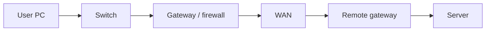

# General Networking

## Learning outcomes

After this module you can:

- Describe a network in **vendor-neutral** language (LAN, WAN, host, hop, path)  
- Name what **switches, routers, firewalls, and servers** each do  
- Use **OSI / TCP-IP** to say *which layer* is failing  
- Explain **DHCP, DNS, default gateway, and NAT** well enough to brief a peer  
- Read a simple **IP plan** and a common-ports table  
- Troubleshoot with **ping, traceroute, and name resolution** before touching a vendor CLI  

This lesson is **not** Juniper-specific. Later modules apply the same ideas on older EX / SRX / PE boxes.

## Why general networking first

Interns who jump straight into `set security zones` cannot tell a **wrong mask** from a **dead DNS** from a **blocked port**. Vendor syntax sits on top of a shared model:

```text
User intent  →  name (DNS)  →  IP + port  →  L2 delivery  →  L3 hops  →  policy
```

SE link: host, port, VRF/zone, and latency are **interface / NFR** fields. A path sketch is a cheap context diagram.

## What a network is

A **network** is a set of nodes that exchange messages under agreed addresses and rules.

| Word | Meaning |
|------|---------|
| **Host / end station** | PC, server, VM, phone — source or destination |
| **Hop** | A router or L3 firewall the packet is forwarded through |
| **Path** | Ordered hops from source to destination |
| **LAN** | One site / one broadcast domain family (closet + core) |
| **WAN** | Links **between** sites (leased Ethernet, MPLS, Internet VPN) |
| **Enclave / segment** | A security or routing boundary (VLAN, subnet, zone, VRF) |



If you cannot draw the path, you cannot debug it.

## Device roles (vendor-neutral)

| Role | Forwards on | Typical job |
|------|-------------|-------------|
| **Switch (L2)** | MAC + VLAN | Connect many hosts in a LAN; does **not** (by itself) leave a subnet |
| **Router (L3)** | IP prefix | Choose next hop; connect subnets and sites |
| **Firewall** | IP + port + policy (+ state) | Allow/deny; often also NAT |
| **Layer-3 switch** | MAC *and* IP (SVI) | VLAN gateway in a closet/core |
| **Access point** | Wireless ↔ Ethernet | Same LAN ideas, radio as the cable |
| **Server / service** | Application | DNS, DHCP, AD, app, database |
| **Encryptor / VPN gateway** | Protected overlay | Confidentiality on a black WAN |

One physical box can play **two roles** (a firewall that also routes). Always say which **role** you are using.

## Layers you actually use

```text
Application     DNS query, HTTPS, BGP message, SSH
Transport       TCP / UDP  +  port numbers
Internet        IPv4 / IPv6, ICMP, routing
Link            Ethernet, VLAN tag, MAC, ARP (IPv4)
Physical        Cable, SFP, radio
```

| Failure example | Layer to name |
|-----------------|---------------|
| Link light off, CRC errors | Physical |
| Wrong VLAN; empty ARP | Link |
| Bad mask; no route | Internet |
| Ping works, TCP/443 reset or silent | Transport / policy |
| IP works, `https://name/` fails | Application (often DNS) |

You do not need to recite all seven OSI names in a briefing. You **do** need the sentence: “this is a link problem” vs “this is DNS.”

## IPv4 in daily work

An address is 32 bits. The **prefix length** (CIDR) says how many bits are the network.

| Prefix | Mask | Typical use |
|--------|------|-------------|
| `/32` | `255.255.255.255` | One host or loopback |
| `/30` | `255.255.255.252` | Point-to-point (2 usable) |
| `/24` | `255.255.255.0` | Common user or server VLAN |
| `/16` | `255.255.0.0` | Site allocation (then split) |

**On-link vs via gateway:** a host only ARP-resolves addresses that fall inside its own prefix. Everything else goes to the **default gateway**.

Worked `/24`: `10.10.10.0/24` → network `.0`, hosts `.1–.254`, broadcast `.255`, gateway usually `.1`.

Worked `/30`: `10.0.0.4/30` → network `.4`, usable `.5` and `.6`, broadcast `.7`.

**RFC 1918** (lab/private): `10.0.0.0/8`, `172.16.0.0/12`, `192.168.0.0/16`. These are not reachable on the public Internet without **NAT**.

The next module drills more arithmetic. Here, remember: **prefix, gateway, and on-link** are the three facts on every host.

## IPv6 (awareness)

IPv6 uses 128-bit addresses (`2001:db8::/32` is documentation). Labs in this course are **IPv4-first**. Know that:

- `fe80::/10` is link-local (like IPv4 169.254, but always present)  
- There is **no ARP** — Neighbor Discovery (ND) replaces it  
- Dual-stack hosts can break on **one** family only  

Do not invent IPv6 on the shared Juniper bench unless the instructor opens it.

## DHCP — how a PC gets an address

**DHCP** (Dynamic Host Configuration Protocol) typically hands out:

| Field | Why it matters |
|-------|----------------|
| IP + mask | Who you are; what is on-link |
| Default gateway | First router |
| DNS server(s) | How names become IPs |
| Lease time | When you ask again |

```text
PC broadcast DHCP Discover
  → server Offer
  → PC Request
  → server ACK
```

If DHCP fails you often see `169.254.x.x` (IPv4 link-local). That is **not** a site address.

Relays: DHCP is a broadcast on the local VLAN. Other subnets need a **DHCP relay** (helper) on the gateway. “PC has no IP” is often VLAN, relay, or exhausted pool — not BGP.

## DNS — how names become addresses

People type names; packets use **IP**. **DNS** maps them.

| Query | Example |
|-------|---------|
| A | `app.ciss-lab.local` → `10.10.20.10` |
| AAAA | same name → IPv6 (if used) |
| PTR | reverse IP → name (optional) |

```bash
# Linux jump VM
getent hosts app.ciss-lab.local
nslookup app.ciss-lab.local
dig +short app.ciss-lab.local
```

| Symptom | First question |
|---------|----------------|
| Browser fails, `ping 10.10.20.10` works | DNS or URL/TLS |
| `ping app` fails, `ping 10.10.20.10` fails | Not (only) DNS — IP path |
| Some PCs work | Those PCs’ DNS server / suffix |

Write **both** the name and the IP in tickets.

## Default gateway and NAT

**Default gateway** = “if the destination is not on my subnet, send it here.”

**NAT** (Network Address Translation) rewrites addresses, usually at the site edge:

| Flavor | Typical use |
|--------|-------------|
| **Source NAT / PAT** | Many private hosts share one public (or WAN) address |
| **Destination / static NAT** | Publish an internal server to the outside |

NAT is **not** a firewall. It is often **on** the firewall. Return traffic must hit the same translator (state). Asymmetric routing around NAT breaks sessions.

## Common ports (memorize the lab set)

| Port | Protocol | Service |
|------|----------|---------|
| 22 | TCP | SSH |
| 53 | UDP/TCP | DNS |
| 67/68 | UDP | DHCP |
| 80 | TCP | HTTP |
| 443 | TCP | HTTPS |
| 123 | UDP | NTP |
| 179 | TCP | BGP |
| 500 / 4500 | UDP | IKE / NAT-T (IPsec) |
| 3389 | TCP | RDP (Windows) |
| 61616 | TCP | ActiveMQ (SW track default) |

An **application** is a protocol + port (+ sometimes payload). “Allow the web” means **TCP/80 and TCP/443**, not a vibe.

## WAN, Internet, and overlays (concepts)

| Path | What the intern should say |
|------|----------------------------|
| **Leased / Metro Ethernet** | L2 or L3 handoff; you still need IP and policy |
| **Internet + VPN** | Reachability via ISP; **confidentiality** via IPsec/TLS |
| **MPLS VPN** | Provider core forwards labels; customer routes at the edge |
| **GRE** | IP-in-IP tunnel; **not** secret by itself |

Overlays fail in two parts: **underlay** (can I reach the peer IP?) and **overlay** (is the tunnel up and is the route pointing into it?). Always test underlay first.

## Wireless (awareness)

Wi-Fi is Ethernet with a radio. Same VLANs, same DHCP, same gateway. Extra failure modes: SSID/VLAN map, controller, weak signal, captive portal. This track’s bench is **wired Juniper**; do not blame BGP for a bad SSID.

## Documentation you will be asked for

| Artifact | Contents |
|----------|----------|
| **IP plan** | Prefix, VLAN, gateway, DHCP range, purpose |
| **Port map** | Switch port → device → VLAN |
| **Path sketch** | Two endpoints, hops, overlay |
| **ACL / policy intent** | Who may speak which port to whom |

If it is not written, the next intern will guess — and guess wrong.

## Generic troubleshooting order

```text
1. Physical / link     lights, errors, correct port
2. Addressing          IP, mask, gateway, DHCP lease
3. L2                  VLAN, MAC/ARP
4. L3                  ping gateway, ping target IP
5. Name                DNS
6. Transport / policy  correct port; firewall
7. Overlay             VPN/MPLS only after underlay works
```

Linux jump-VM kit (pairs with the admin track):

```bash
ip addr
ip route
ping -c 4 10.10.10.1
traceroute -n 10.20.10.1
ss -lntp
getent hosts app.ciss-lab.local
```

**Ping is ICMP.** It does not prove TCP/443.

## Security habits (every network)

- **Least privilege** — allow the ICD ports, not `any/any`  
- **Segment** — users, servers, management, WAN are not one flat VLAN  
- **Management plane** — SSH/HTTPS to infrastructure is not user traffic  
- **No scanning** outside the lab sheet  
- **No secrets** in Git (PSK, community strings, TACACS)

## How this module feeds the Juniper path

| General idea | Where it shows up next |
|--------------|------------------------|
| VLAN / trunk | EX switching |
| Gateway / mask | Foundations drill + SRX IFL |
| DHCP / DNS | Host side; admin + jump VM |
| NAT / policy / ports | SRX firewall |
| Underlay vs overlay | OSPF/BGP, then MPLS and IPsec |
| Change discipline | Junos commit model |

## Drill (35–45 min)

No device commits:

1. Label each box in the welcome fabric as switch, router/firewall, PE, or encryptor.  
2. For a PC `10.10.10.50/24` gw `10.10.10.1` DNS `10.10.20.53`, list what DHCP would have provided.  
3. User says “the portal is down.” Write the **first four tests** in order (include a name and a raw IP).  
4. Convert `255.255.255.252` to prefix length and say what the link is for.  
5. Name three ports from the table and what breaks if they are blocked.

## Integrity

- Do not scan campus or production.  
- Do not treat home Wi-Fi as the CISS lab.  
- Unclassified notes only.

## Further reading

| Topic | Source |
|-------|--------|
| Internet layers | [RFC 1122](https://www.rfc-editor.org/rfc/rfc1122) |
| CIDR | [RFC 4632](https://www.rfc-editor.org/rfc/rfc4632) |
| DHCP | [RFC 2131](https://www.rfc-editor.org/rfc/rfc2131) (concepts) |
| DNS intro | [MDN — What is DNS](https://developer.mozilla.org/en-US/docs/Glossary/DNS) |
| Private addresses | [RFC 1918](https://www.rfc-editor.org/rfc/rfc1918) |

## Next

**Network foundations** — more IPv4 math, ARP vs route, and the Site-A → Site-B path you will reuse on Junos.
