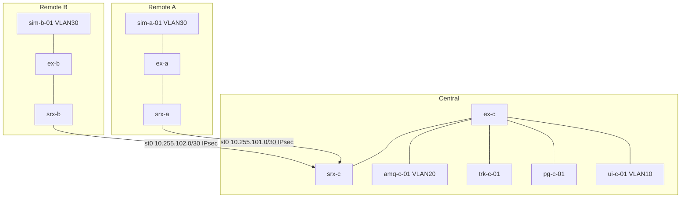

# PRSAS — Three-Site Topology

> **Phase:** implementation. Extends the **net-00** fabric; do not invent a parallel addressing religion.

## Learning outcomes

After this module you can:

- Draw a **logical** three-site topology (Remote A, Remote B, Central) with VLANs and VRFs/zones named  
- Place **EX** (access/server) and **SRX** (zone edge) per site  
- Publish an **addressing plan** that SW/ADMIN can configure against  
- Write **intent** firewall rules (ports/protocols) before touching `set security`  
- Keep red/black and mgmt planes honest  

## Sites

| Stack | What lives there | Switch / firewall |
|-------|------------------|-------------------|
| Remote A | `sim-a-01` | `ex-a-*`, `srx-a-fw-01` |
| Remote B | `sim-b-01` | `ex-b-*`, `srx-b-fw-01` |
| Central | AMQ, daemon, PG, IPA, CA, UI | `ex-c-*`, `srx-c-fw-01` |

Physical Juniper EX2300 / SRX300 appear in the project BOM. If the bench is virtual Junos + a virtual firewall VM, **say so** and keep the same logical zones.

## Addressing (teaching — confirm on the lab sheet)

| Block | Use |
|-------|-----|
| `10.10.30.0/24` | Remote A radar VLAN 30 |
| `10.20.30.0/24` | Remote B radar VLAN 30 |
| `10.30.10.0/24` | Central users / UI VLAN 10 |
| `10.30.20.0/24` | Central servers VLAN 20 |
| `10.255.0.0/24` | Management VLAN 99 |
| `10.255.101.0/30` | IPsec A↔Central |
| `10.255.102.0/30` | IPsec B↔Central |

Reuse net-00 Site-A/B user blocks if those VLANs already exist. Do not renumber the whole academy to look clever.

## Allow-list (intent — implement in net-12)

| Src zone | Dst zone | Port / proto | Why |
|----------|----------|--------------|-----|
| remote-radar | central-amq | TCP 61617 | OpenWire TLS |
| remote-radar | central-amq | TCP 61614 | STOMP TLS (if enabled) |
| central-app | central-amq | TCP 61617 | daemon + clients |
| central-app | central-db | TCP 5432 | daemon JDBC |
| central-ui | central-db | TCP 5432 | bulk load **or** deny if a REST proxy is used |
| central-ui | ipa | 88, 389/636, 443 | auth |
| any | mgmt | 22, 8161 | **mgmt only**, never from radar VLAN |
| remote | central | ICMP | lab echo only if instructor wants it |

Default: **deny**. “Permit any any so we can demo” is a fail on NET-A11.

## Monday workshop (builds NET-A11)

1. **20 min** — L2/L3 diagram with hostnames and VLANs.  
2. **20 min** — Address workbook (gateway, mask, one example host IP each).  
3. **20 min** — Allow-list table (copy above, delete one row you can justify, add one).  
4. **20 min** — Peer review: can ADMIN pick IPs without asking you in Slack?

## Thursday assignment

**NET-A11 — Topology & addressing pack.**

## Next

**Secure path** — SRX zones, policies, NAT-or-not, and IPsec tunnels.
