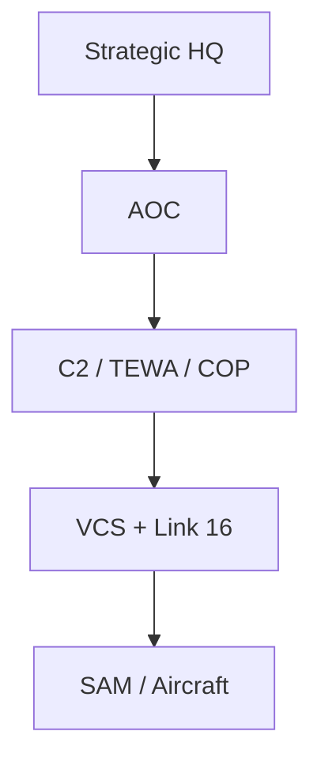
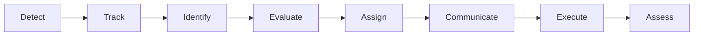

# Military Ops — CONOPS & Air Operations Center (AOC)

> **Source:** Training lecture provided by military SME —  
> *Concept of Operations (CONOPS) · Air Operations Center (AOC) · Voice Communication Systems*  
> (Frequentis VCS context). Classroom / training use. **Unclassified operational concepts only.**

> **Glossary (quick)**  
> **CONOPS** — Concept of Operations; how a system is used in the real world.  
> **AOC** — Air Operations Center; hub for planning, monitoring, and directing air missions.  
> **C2** — Command and control.  
> **TEWA** — Threat Evaluation and Weapon Assignment (prioritize threats; assign responses).  
> **COP** — Common Operational Picture (shared battlespace picture).  
> **VCS** — Voice Communication System (training context: Frequentis — radio, phone, VoIP, recording, redundancy).  
> **Link 16** — Tactical datalink for digital tactical data (training-level mention).  
> **SE** — Systems Engineering; turns operational needs into testable requirements and design.

## Ops track roadmap

```text
UAE Military Context  →  CONOPS & AOC  →  ATO Planning  →  ATO Execution  →  Weapons & Platforms  →  Capstone
   (previous)              (this module)     (A5 card)      (execution annex)    (public vocabulary)
```

**Prerequisite:** *UAE Military Context (Open Source)* — branches, ranks, public systems vocabulary.  
If that module is scheduled the same day, cover UAE context first.

## Learning outcomes

| # | After this module you can… | Maps to lecture objectives |
|---|----------------------------|----------------------------|
| 1 | Define **CONOPS** and its place relative to needs and design | Define CONOPS |
| 2 | Describe **AOC** role in the C2 chain | Understand AOC operations |
| 3 | Sketch detect→assess **operational workflow** | Communication workflow |
| 4 | Name major **roles** and **voice/data** paths | Operator responsibilities |
| 5 | Connect CONOPS language to the SE cascade (vision → needs → use cases → requirements) | All of the above, as SE artifacts |

> **Facilitator tip:** ~15 min glossary + architecture, ~20 min workflow + VCS, ~40 min scenario workshop. Common misconception: “CONOPS is a software design doc.” Push back — it is **how ops run**, then SE derives needs/use cases/requirements.

## Readiness (optional pre-check)

Before Monday, skim the course **Glossary** (`/glossary`) for CONOPS, AOC, COP, TEWA, VCS, ATO, C2. You do **not** need prior military service — only willingness to learn operational vocabulary at training level.

---

## What is CONOPS?

**Concept of Operations (CONOPS)** describes **how a system is used** in the real world.

| CONOPS covers | Why it matters for SE |
|---------------|------------------------|
| Users / operators | Stakeholders and needs (**derives_from** vision) |
| Missions and operational concepts | Vision + use cases |
| How people and systems interact | Use cases, sequences, interfaces |

### CONOPS bridges requirements and design

```text
VISION / NEED  →  CONOPS (how ops run)  →  USE CASES  →  REQUIREMENTS  →  DESIGN
                      (ops story)           traces_to     allocated_to
```

If you skip CONOPS, requirements often describe software features with no operational story.

### Purpose of CONOPS (lecture)

- Standardize operations  
- Improve readiness  
- Enhance decision-making  
- Increase mission success  

---

## Operational environment

An AOC does not sit alone. Typical information and force elements around it:

| Domain | Examples (training level) |
|--------|---------------------------|
| Sensors | Radar |
| Tactical data | Link 16 |
| EW | Electronic warfare feeds / awareness |
| Intelligence | Intel products supporting ID and intent |
| Weather | Mission planning and safety |
| Higher HQ | Strategic / operational direction |

**SE habit:** each of these is a potential **external system** on your context diagram (and often an ICD later).

---

## AOC architecture (training sketch)

```text
Strategic HQ
      ↓
     AOC
      ↓
  C2 / TEWA / COP
      ↓
 Frequentis VCS + Link 16
      ↓
   SAM / Aircraft
```



| Layer | Role (plain language) |
|-------|------------------------|
| Strategic HQ | Higher command intent and tasking |
| **AOC** | Air operations hub — plan, monitor, direct |
| C2 / TEWA / COP | Command & control, threat evaluation/weapon assignment, common operational picture |
| Frequentis VCS + Link 16 | Voice communications + tactical datalink |
| SAM / Aircraft | Effectors / airborne assets that execute |

**TEWA** prioritizes threats and assigns responses; **COP** shares one picture of the air situation.  
**Frequentis VCS** in this training context is the **voice communication system** (radios, phones, VoIP, recording, redundancy, emergency calls).

---

## Major components

1. Sensors  
2. C2 system  
3. Voice communications  
4. Data links  
5. Mission planning  

Map these to SE:

| Component | Typical SE artifact |
|-----------|---------------------|
| Sensors / links | Interface ICDs, feed use cases |
| C2 / COP / TEWA | Core system boundary, behavior models |
| Voice (VCS) | Human–system interface + recording/audit NFRs |
| Mission planning | ATO planning use cases (next module) |

**Concrete SE sketch (VCS as interface):** a lightweight ICD might name parties (AOC VCS ↔ aircraft radio net), format (voice net ID + recording flag), timing (real-time), errors (primary net loss → failover net), security (authorized operators only). You will practice ICD form in the Interfaces module; here, only recognize that **voice is a contract**, not “just a phone.”

---

## Operational workflow (detect-to-assess)

Lecture sequence:



```text
Detect → Track → Identify → Evaluate → Assign → Communicate → Execute → Assess
```

| Step | Meaning for interns |
|------|---------------------|
| Detect | Something is sensed |
| Track | Continuity over time |
| Identify | Friend / foe / unknown (at training level) |
| Evaluate | Threat significance (TEWA) |
| Assign | Weapon / asset / response |
| Communicate | Voice and/or datalink orders |
| Execute | Shooter / aircraft / SAM acts |
| Assess | Did it work? Update picture |

**SE link:** each arrow can become a **use case** or **sequence**; evaluate/assign often involve **human-in-the-loop** requirements (ties to AIC2 vision principles).

---

## Roles and responsibilities

| Role | Focus (training) |
|------|------------------|
| Operator | Execute assigned C2 / console tasks |
| Supervisor | Oversee operators, escalate, quality of COP actions |
| Commander | Authority and decisions |
| Communication Operator | Voice nets, patches, discipline on VCS |

When writing needs:

```text
As AOC operators,
we need a clear COP and reliable voice paths to effectors,
so that we can complete detect-to-assess actions under time pressure.
```

---

## Frequentis Voice Communication System (VCS)

Capabilities called out in the lecture:

- Radio  
- Telephone  
- VoIP  
- Recording  
- Redundancy  
- Emergency calls  

### Communication flow (lecture)

```text
Radar → C2 → TEWA → Supervisor → Frequentis VCS → SAM / Aircraft
```

**SE note:** Voice is a **mission-critical interface** with recording, failover, and phraseology — good NFR and IF/THEN material (loss of primary net, emergency call, etc.).

### Voice best practices

- Standard phraseology  
- Read-back  
- Clear communication  
- Record critical traffic  

These become **procedure requirements** or training CONOPS, not only software FRs.

---

## Operational scenarios (for exercises)

1. **Normal mission** — routine detect-to-assess with voice + datalink  
2. **Emergency communications** — alternate paths, emergency call, recording  
3. **Multiple threat response** — TEWA prioritization, concurrent assign/communicate  

### Workshop

Pick one scenario → write **1 need** + **2 use cases** + **3 EARS requirements** (at least one IF/THEN for comms failure).

### Sample (fictitious training depth)

**Scenario:** Emergency communications (primary VCS net loss).

**Need**

```text
As AOC communication operators,
we need an alternate voice path with recording when the primary VCS net fails,
so that we can still issue time-critical tasking to airborne assets.
```

**Use cases**

| UC-ID | Name | Goal |
|-------|------|------|
| UC-VCS-01 | Fail over to backup voice net | Operator restores command path within procedure time |
| UC-VCS-02 | Log emergency call | Supervisor can audit critical traffic after the event |

**EARS requirements (sketch)**

1. **WHEN** the primary VCS net is declared unavailable, the AOC voice system shall present the designated backup net for selection. *[WHEN]*  
2. **WHILE** traffic is carried on the backup net, the AOC voice system shall record the channel per the recording policy. *[WHILE]*  
3. **IF** both primary and backup nets are unavailable, **THEN** the AOC voice system shall alert the supervisor console and shall not silently drop the call request. *[IF/THEN]*  

Note the chain: need **derives_from** mission success / comms reliability; need **traces_to** use cases; use cases **allocated_to** FRs. ACs would prove these shalls without inventing new thresholds.

---

## Cybersecurity (lecture)

- Secure credentials  
- Approved channels only  
- Report incidents  

Trace to NFRs: authentication, authorized voice/data paths, audit of critical actions.

---

## Summary (lecture)

```text
People + Procedures + Technology + Communications = Mission Success
```

## Tie-back to CISS SE Capstone

| SE layer | What to take from this CONOPS |
|----------|-------------------------------|
| Vision | Mission success via people + procedures + tech + comms |
| Needs | Operators, supervisors, commanders, comms operators |
| Use cases | Detect…assess chain; emergency comms; multi-threat |
| Requirements | C2, COP, TEWA, VCS, Link 16 interfaces; HITL on assign |
| Design | Out of scope for this module — architecture later |

## Offline reading

- SME training deck: linked from course materials when published; file in repo at `content/reference/CONOPS_AOC_Frequentis_Training_Lecture.pptx` (instructor may also post under **Home** / reference).  
- Course **Glossary** for term refresh.  
- Next: **ATO Planning** (missions, loadout, tankers, timing) builds on AOC as the hub that publishes and monitors tasking.

## Self-check (5 min)

1. In one sentence, what does **CONOPS** describe?  
2. Place these in order top → bottom: SAM/Aircraft, Strategic HQ, AOC, VCS+Link 16, C2/TEWA/COP.  
3. Expand **TEWA** and **COP**.  
4. Name one reason voice (VCS) is an **SE interface** concern, not “just a phone.”  
5. In the detect-to-assess chain, which two steps most often need **human-in-the-loop** requirements?  

### Answers

1. How a system is **used** in the real world (ops story: people, missions, interactions).  
2. Strategic HQ → AOC → C2/TEWA/COP → VCS+Link 16 → SAM/Aircraft.  
3. Threat Evaluation and Weapon Assignment; Common Operational Picture.  
4. Recording, failover, authorized users, phraseology/procedures → NFRs and IF/THEN FRs / ICD fields.  
5. **Evaluate** and **Assign** (authority and judgment); Communicate also involves HITL procedures.

## Next

**Military Ops — Air Tasking Order (Planning)** — how missions are built before execution (feeds Assignment **A5**).
