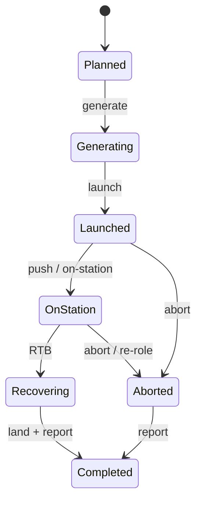

# Military Ops — ATO Execution

> Training context only. **Unclassified** conceptual material.  
> **Safety of flight:** all exercises assume compliance with applicable flight-safety SOPs and training rules. This module does **not** authorize real flying or real weapons employment.

**Prerequisite:** ATO Planning mission card (or draft) from the previous module / Assignment A5.

## Learning outcomes

| # | After this module you can… |
|---|----------------------------|
| 1 | Describe execution activities after the ATO is published |
| 2 | Contrast training, strike (exercise/conceptual), and air defense execution focus |
| 3 | List common **change drivers** during execution |
| 4 | Connect execution to **after-action** / lessons |

> **Facilitator tip:** ~15 min plan→wheels-up + mission flavors, ~15 min change drivers + C2, ~30 min execution annex workshop. Misconception: “ATO never changes.” Emphasize **baseline that flexes**.

## From plan to wheels up

Execution starts when the plan is **actionable** and forces begin to:

1. **Generate** aircraft (maintenance + crew ready)  
2. **Launch** on timing  
3. **Push** to assigned roles / stations / targets  
4. **Monitor** progress against the plan  
5. **Adjust** (weather, aborts, higher HQ direction)  
6. **Recover** safely  
7. **Report** results / status  

The ATO is not a movie script — it is a **baseline** that will flex.

### SE parallel — mission state (simple)

Same habit as software state charts: name **legal** transitions and **illegal** ones (e.g. “recover” before launch).

## Execution by mission flavor

### Training mission

- Safety and learning objectives dominate  
- Debrief quality matters as much as “completing the profile”  
- Injects may simulate threat without real munitions expenditure  

### Air defense / CAP-style

- On-station timing and coverage matter  
- Handover between CAP stacks / shifts  
- Rules of engagement (conceptual) and ID procedures matter more than strike weaponeering  

### Strike / attack (exercise or conceptual)

- Time-on-target discipline  
- Coordination with support (tankers, EW, SEAD concepts at high level)  
- Battle damage / effects reporting (exercise metrics)  

You are not learning weaponeering math here — you are learning **what planners and C2 watch for**.

## Change drivers in execution

| Driver | Example response |
|--------|------------------|
| Weather | Delay, re-route, cancel |
| Maintenance abort | Spare aircraft, scrub mission |
| Higher priority pop-up | Re-role package |
| Datalink / comms loss | Fall back to voice procedures |
| Tanker slip | Shorten station time / divert |
| Threat change (exercise inject) | Hold, abort, or replan |

## C2 and feedback loops

Execution needs:

- **Status** — airborne, on-station, RTB, landed  
- **Exceptions** — anything off plan that matters  
- **Authority** — who can change what  

**SE link:** runtime system with states and messages — like software state charts and sequences, but with humans and aircraft.

## After action

Good organizations:

1. Capture what differed from plan  
2. Separate bad luck from bad planning  
3. Feed next ATO cycle  

### After-action review (AAR) — template

Use after a workshop inject or tabletop:

| Category | Observation | Impact | Recommended action |
|----------|-------------|--------|--------------------|
| Timing | e.g. Launch delayed 7 min (fuel-pump inject) | Reduced on-station window | Strengthen generate checklist |
| Comms | e.g. Backup net used after primary fail | No loss of C2 | Keep dual-net plan; practice failover |
| Threat / inject | e.g. Re-role of 1 aircraft | Workload spike | Spare / re-role procedure on card |
| Fuel | e.g. Tanker slip | Early RTB risk | +margin or alternate tanker concept |
| Success metric | e.g. Coverage minutes achieved | Met / missed criteria | Keep or rewrite success criteria |

Short form also works: **What went well · What did not · Why · Action items**.

## Workshop — execution annex (A5)

Take your A5 mission card. Add an **execution annex**:

- 3 things you will **monitor**  
- 2 **change scenarios** + your response  
- 1 **success metric** you can observe  

### Sample annex (for the CAP card in ops-01)

| Item | Example |
|------|---------|
| Monitors | (1) On-station time remaining (2) Primary/backup voice net status (3) Datalink track health |
| Change 1 | Maintenance abort on primary → launch spare; slip on-station by ≤10 min or scrub if spare unavailable |
| Change 2 | Datalink loss → voice-only SA; tighten ID/report cadence to C2 |
| Success metric | ≥90% of planned on-station minutes with continuous C2 contact (voice and/or datalink) |

## Selection signal

We look for interns who respect **ops reality** (timing, aborts, comms, safety) — not only clean diagrams.

## Self-check (5 min)

1. List the seven **from plan to wheels up** activity words (generate … report).  
2. Give two **change drivers** and a plausible response for each.  
3. What three things does C2 need during execution (status / exceptions / …)?  
4. Sketch or name five **mission states** from the simple state model.  
5. What four columns appear in the **AAR** template used in this module?  

### Answers

1. Generate → Launch → Push → Monitor → Adjust → Recover → Report.  
2. Examples: weather → delay/re-route; maintenance abort → spare/scrub; datalink loss → voice procedures; tanker slip → shorten station/divert.  
3. **Status**, **exceptions**, **authority** (who can change what).  
4. e.g. Planned, Generating, Launched, OnStation, Recovering, Aborted, Completed.  
5. Category · Observation · Impact · Recommended action.

## Next

**Weapons & platforms context** — public vocabulary to justify platform choices on your mission card, then prepare for radar SA capstone later.
