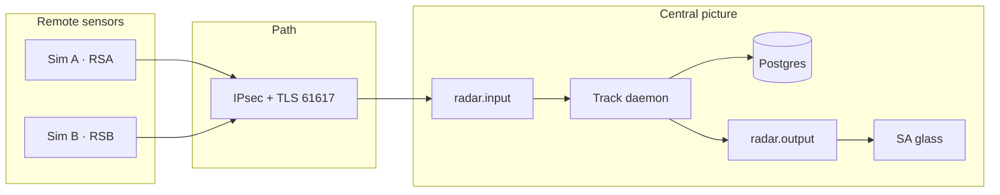

# PRSAS Intro — The Picture That Keeps a Country

> **Audience:** every intern, every track. Week 14 Monday, first hour, **one room**.  
> **Then** **se-12** (shared contracts). Discipline modules start this week after the contracts freeze.  
> **Prerequisite:** weeks 10–11 (UAE context, CONOPS/AOC, ATO planning & execution, public platforms, A5).  
> **Classification:** unclassified / open source. Teaching picture only.

## Learning outcomes

After this module you can:

- Restate **why a fused air picture exists** using weeks 10–11 language (detect → assess, COP, ATO)  
- Place **PRSAS** on the right side of a hard line: *classroom shape* of a picture, **not** live C2, **not** THAAD/Patriot  
- Point at the three-site teaching picture and say what **each track** owes it  
- Use one public episode (Iranian attacks on the UAE from **28 February 2026**, MoD/WAM) **without** inventing rates, basing, or ROE  
- Hand off into **se-12** without mixing CONOPS-the-feeling with contracts-the-ICD

## The line from weeks 10–11

You already have the ops words. Use them.

| Week 10–11 word | What it meant | What PRSAS practices |
|-----------------|---------------|----------------------|
| **Detect → assess** (**ops-00**) | Sensor to AOC workflow | Plot in, track out, operator speaks |
| **COP** | Shared battlespace picture | One fused track, two clients, same Postgres |
| **AOC** | Hub that plans and directs | Central site is the lab stand-in for “where the glass lives” |
| **ATO** (**ops-01 / ops-02**) | The plan, then the flying of the plan | The picture is what the plan is *about*; we do not task live missions here |
| **TEWA** | Prioritize threats, assign responses | **Out of lab scope.** We stop at an honest picture. |
| **Mode 3/A** | A code, not identity | Correlation key. Never “that squawk is a hostile.” |
| **A5 card** | Planning factors + execution annex | Your capstone artifacts are the engineering annex of that kind of honesty |

If the glass lies, CONOPS is fan fiction and ATO is a guess. That is the whole course.

## Why this problem is not academic

From **28 February 2026**, Iran launched missiles and drones at the UAE. The Ministry of Defence, via WAM and on-the-record briefings, said UAE air force and air defence **detected and intercepted** the large majority of those raids using a **layered** architecture (public families: **THAAD**, **Patriot**, SHORAD). Public reporting also recorded **fatalities and injuries**, including from **interception debris** — defence is not a video game, and this module will not pretend otherwise.

Numbers in the press **moved by the day**. Interns do **not** memorize a scoreboard. Interns remember three public facts:

1. **Sensors and a picture** had to exist *before* an interceptor had something true to shoot at.  
2. **Layered AD** (high / medium / short) is a system of systems — the same idea as your three-site lab, at a different scale and classification.  
3. **People** watched the glass, spoke on the net, and lived with debris when the intercept was the least-bad outcome.

**Integrity:** this paragraph is **open-source civic memory**, not an order-of-battle. Do not add bases, battery counts, ROE, or “we have the intercept rate.” If you need a citation in a slide, use a **dated** WAM / MoD clip the instructor hands you.

PRSAS is **not** that shield. THAAD and Patriot are not your Java homework. You are building a **classroom analogue of the picture**: two simulated radars, a path that can be encrypted and firewalled, a daemon that correlates, a glass an intern can brief, hosts and certs that do not silently rot.

The people who kept the country up had years of integration behind them. You have five weeks. So we freeze the contracts on **se-12** and each track owns one failure mode.

## The teaching picture

Projector: play the film, then leave the **live picture** running (three sites, RSA / RSB plots, fused track, COAST).

*CISS-TEACH. Stylized gulf. No real unit, no real site.*

**Postcondition of UC-CISS_PROJECT-001:** a watch intern can brief one fused picture from two simulated feeds, with an audit trail, without lying about COAST or CONFLICT.

## Who keeps which pixel honest

| Track | On this picture | Failure that shows up on the glass |
|-------|-----------------|------------------------------------|
| **SE** | CONOPS, schema, ICD, V&V | Dual-feed conflict with no requirement |
| **SW** | Simulator, daemon, client | Silent pick of feed A; Mode 3/A treated as identity |
| **NET** | Three-site fabric, IPsec, allow-list | Picture that only works on the wrong VLAN |
| **ADMIN** | VMs, IPA, lab CA, clocks, harden | Cert expired Thursday; fusion looks “down” |
| **MIL** | Operator / supervisor voice | “Hostile” on a squawk; COAST called “gone” |

No track finishes alone. Integration week is shared.

## 15-minute floor exercise

Stand. One intern per track, one sentence, out loud:

> “If my piece is wrong, the operator will see ________.”

Write the five sentences on the board. They stay there through week 18.

Then sit. **se-12** freezes topics, ports, and CISS-TEACH-1. Do not reopen “what if we used Kafka” in that hour.

## Integrity (grade-zero if you break it)

| Allowed | Not allowed |
|---------|-------------|
| Public MoD/WAM language with a **date** | Invented intercept %, battery maps, ROE |
| “Classroom shape of a picture” | “We are building the UAE missile shield” |
| Mode 3/A as a **code** | IFF Mode 4/5, Link 16 employment, live tracks |
| COAST / CONFLICT as operator words | TEWA, automatic engage, weapons-free talk |
| Fictional theater on the poster | Real UAE base names on a slide |

`curl -k` and `trustAll` are still fails. A pretty glass on a lying path is how people die with a green screen.

## What happens next (this week)

| When | Who | What |
|------|-----|------|
| Rest of Monday | All tracks | **se-12** — interface & ownership map (SE-A12 assigned) |
| Thursday | All tracks | SE-A12 due |
| Week 15 | Split rooms + MIL picture | CONOPS / simulator / topology / provision / **ops-04** |
| Week 18 | All tracks | Integration demo — MIL speaks the glass |

## Further reading

| Topic | Where |
|-------|--------|
| UAE context (open source) | **ops-uae-military** |
| CONOPS / AOC / detect-to-assess | **ops-00** |
| ATO + A5 | **ops-01**, **ops-02** |
| Operator picture (week 15) | **ops-04** |
| Contracts (today, next hour) | **se-12** |
| Use case | UC-CISS_PROJECT-001 in `content/project/radar_sa_project.md` |
