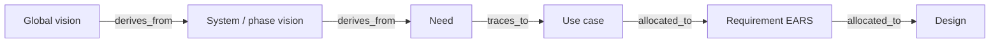

# What Is Systems Engineering?

## Learning outcomes

After this module you can:

- Explain SE in one paragraph to a non-engineer  
- Follow the course derivation chain: **Vision → Needs → Use cases → Requirements → Design**  
- Trace each requirement back to a vision, need, and use case (traceability).
- Separate those layers without mixing them  
- Name why projects fail without SE discipline  

## The one-paragraph definition

**Systems engineering** is the discipline of making sure we understand the real-world problem, capture what the system must do (and not do), design a solution that can be built and tested, integrate the pieces, and prove we met the need — across hardware, software, people, and process.

It is *not* only drawing diagrams. Diagrams are tools. The product of SE is **decisions under evidence**.

## The course derivation chain (memorize this)

In practice, strong teams get **everyone on the same perspective** before writing shall-statements. This course uses a cascade that works well on real programs (including prior CISS-style SE efforts).

Layers are not connected by a vague “refine” link. Use the **same relationship names** you will see on program artifact graphs:

```text
(GLOBAL) VISION  →  SYSTEM / PHASE VISION  →  NEED  →  USE CASE  →  REQUIREMENT  →  DESIGN
                         derives_from           derives_from   traces_to   allocated_to   allocated_to
```

| Relationship | From → To | Meaning |
|--------------|-----------|---------|
| **derives_from** | System/phase vision → global (or parent) vision | Specialized vision is grounded in the broader program picture |
| **derives_from** | Need → vision | Stakeholder need is justified by the vision (or a vision principle) |
| **traces_to** | Need → use case | The need is realized by one or more goal-oriented interactions |
| **allocated_to** | Use case → requirement | The use case is specified by one or more shall-statements (EARS) |
| **allocated_to** | Requirement → design | The FR is allocated to a design element (service, module, ICD, …) |

One parent can fan out: one vision → many needs; one need → many use cases; one use case → many FRs.

### Teaching example (AIC2-style graph)

Program tools often show **IDs on every node** and the link type on the edge — e.g. global vision → AIC2 vision → need → use case → requirement:


*Example chain (labels match the edges above):*  
`TR2-GLOBAL-VISION-…` → **derives_from** → `TR2-AIC2-VISION-…` → **derives_from** → `TR2-AIC2-NEED-…` → **traces_to** → `TR2-AIC2-UC-…` → **allocated_to** → `TR2-AIC2-REQ-…`

### Course cascade (compact)

```text
VISION  →  NEEDS  →  USE CASES  →  REQUIREMENTS  →  DESIGN / IMPLEMENTATION
   │          │           │              │                    │
 shared    who/why     how people     what the system      how we build it
 picture   benefit     use it         shall do (EARS)
```



*Alt text: Artifact chain with link types derives_from (visions and need), traces_to (need to use case), allocated_to (use case to requirement to design).*

Optional display math (KaTeX) when you need formal models later:

$$
R_{\mathrm{trace}} = \frac{\\#\{\mathrm{FR\ with\ UC\ and\ test}\}}{\\#\{\mathrm{FR}\}}
$$

*R_trace* is the proportion of functional requirements that are traceable to a use case **and** an acceptance test — a simple coverage habit for later RTMs.

| Layer | Question | Artifact form (this course) | Typical tool / file type |
|-------|----------|------------------------------|--------------------------|
| **Vision** (global and/or system) | What future are we building toward together? | Short vision statement + optional key principles; child vision **derives_from** parent when both exist | .md or Confluence page |
| **Needs** | Who needs what, so that what benefit? | `As <stakeholder>, we need …, so that …` — need **derives_from** vision | .md, .txt |
| **Use cases** | How does a stakeholder achieve value with the system? | Named use case: actor, goal, main flow, extensions — need **traces_to** use case | .md, .xlsx |
| **Requirements** | What shall the system do in each situation? | EARS + shall, IDs, acceptance criteria — use case **allocated_to** requirement | .md, .reqs |
| **Design** | How will we implement it? | Architecture, modules, algorithms, UI — requirement **allocated_to** design | .md, .drawio, .py |

**Common intern mistake:** jumping straight to design or to shall-language without a shared vision and named stakeholders — missing **derives_from** / **traces_to** links entirely.

### Why start with vision?

Vision is not always labeled as a formal “SE process step” in every textbook, but it is **widely used** and extremely useful:

- Aligns leadership, ops, and engineers on **one picture**  
- Frames phase boundaries (e.g. Tech Refresh Phase 2 vs Phase 1)  
- Gives criteria for “in spirit of the program” when requirements conflict  
- Becomes the north star for **validation** (“did we move toward this vision?”)  

Every need **derives_from** a vision (or principle). Each need **traces_to** one or more use cases; each use case is **allocated_to** requirements. If an FR cannot walk back through those links, question it (gold plating risk).

### Tiny example (time tracker)

| Layer | Example |
|-------|---------|
| Vision | A single, auditable FOSC attendance system that staff can use in seconds and program can export without rework |
| Need | As FOSC admins, we need TEMPO-aware export … so that packages are defensible |
| Use case | Manager exports quarterly FOSC package |
| Requirement | WHEN an authorized user exports a quarter, the ETAS shall include a Discrepancy Tracker sheet |
| Design | `fosc_export.build_fosc_quarterly_workbook` |

### Larger example (mission C2 — teaching style)

A real program vision might describe **hybrid human-AI command and control**, open standards (e.g. MOSA), levels of autonomy, and resilient ops in dense airspace. From that vision you derive operator **needs**, then **use cases** (e.g. correlate tracks, recommend COA, engage with oversight), then **EARS requirements**. Full vision craft is in the next module.

## Why SE matters here

On CISS-type work you will touch:

- **Multiple users and roles** — you coordinate disparate stakeholder needs  
- **External systems** — feeds, exports, and other apps with real contracts  
- **Defensible rules** — decisions must survive review and audit  
- **Ops people** — planners and operators, not only developers  

SE gives a shared language so software, ops, and leadership do not talk past each other. **Vision is the first shared language.**

## Classic failure modes (watch for these in your work)

1. **No shared vision** – every team invents a different product.  
2. **Unstated assumptions** – “obvious” to you, invisible to the tester.  
3. **Gold plating** – features nobody needed (no path to vision/need).  
4. **Interface surprises** – two teams meet at a boundary with different formats.  
5. **Untestable “requirements”** – “the UI shall be intuitive.”  
6. **No validation** – built the wrong thing correctly.  
7. **AC papers over a bad FR** – thresholds live only in acceptance criteria; customer later enforces *their* reading of the contractual shall.  


## Offline exercise (30 min)

Pick any app you use daily (banking, maps, chat). Write:

1. **Vision** – 2–4 sentences describing the next‑version goal.  
2. **Need** – One stakeholder statement: `As <stakeholder>, we need …, so that …`.  
3. **Use case** – Name, actor, and goal (one sentence each).  
4. **EARS requirement** – One shall‑statement supporting the use case.  
5. **Design choice** – One concrete implementation decision *not* phrased as a requirement.

Bring the worksheet to Thursday; you may submit electronically if you’re unsure.

> **Reminder:** If you generate any wording with an AI tool, add an in-text citation (e.g., *Generated with ChatGPT, 2026*). The underlying idea and structure must still be yours.

## Next

**Vision, Stakeholders & Needs** — how to write a vision statement, list stakeholders, and derive needs in the course grammar.
