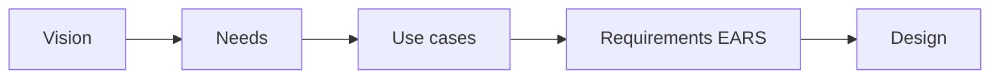

# What Is Systems Engineering?

## Learning outcomes

After this module you can:

- Explain SE in one paragraph to a non-engineer  
- Follow the course derivation chain: **Vision → Needs → Use cases → Requirements → Design**  
- Separate those layers without mixing them  
- Name why projects fail without SE discipline  

## The one-paragraph definition

**Systems engineering** is the discipline of making sure we understand the real-world problem, capture what the system must do (and not do), design a solution that can be built and tested, integrate the pieces, and prove we met the need — across hardware, software, people, and process.

It is *not* only drawing diagrams. Diagrams are tools. The product of SE is **decisions under evidence**.

## The course derivation chain (memorize this)

In practice, strong teams get **everyone on the same perspective** before writing shall-statements. This course uses a cascade that works well on real programs (including prior CISS-style SE efforts):

```text
VISION  →  NEEDS  →  USE CASES  →  REQUIREMENTS  →  DESIGN / IMPLEMENTATION
   │          │           │              │                    │
 shared    who/why     how people     what the system      how we build it
 picture   benefit     use it         shall do (EARS)
```



Optional display math (KaTeX) when you need formal models later:

$$
R_{\mathrm{trace}} = \frac{\#\{\mathrm{FR\ with\ UC\ and\ test}\}}{\#\{\mathrm{FR}\}}
$$

| Layer | Question | Artifact form (this course) |
|-------|----------|------------------------------|
| **Vision** | What future are we building toward together? | Short vision statement + optional key principles |
| **Needs** | Who needs what, so that what benefit? | `As <stakeholder>, we need …, so that …` |
| **Use cases** | How does a stakeholder achieve value with the system? | Named use case: actor, goal, main flow, extensions |
| **Requirements** | What shall the system do in each situation? | EARS + shall, IDs, acceptance criteria |
| **Design** | How will we implement it? | Architecture, modules, algorithms, UI |

**Common intern mistake:** jumping straight to design or to shall-language without a shared vision and named stakeholders.

### Why start with vision?

Vision is not always labeled as a formal “SE process step” in every textbook, but it is **widely used** and extremely useful:

- Aligns leadership, ops, and engineers on **one picture**  
- Frames phase boundaries (e.g. Tech Refresh Phase 2 vs Phase 1)  
- Gives criteria for “in spirit of the program” when requirements conflict  
- Becomes the north star for **validation** (“did we move toward this vision?”)  

Needs, use cases, and requirements should **trace back** to the vision. If a requirement cannot connect to vision or a need, question it (gold plating risk).

### Tiny example (time tracker)

| Layer | Example |
|-------|---------|
| Vision | A single, auditable FOSC attendance system that staff can use in seconds and program can export without rework |
| Need | As FOSC admins, we need TEMPO-aware export … so that packages are defensible |
| Use case | Manager exports quarterly FOSC package |
| Requirement | WHEN an authorized user exports a quarter, the ETAS shall include a Discrepancy Tracker sheet |
| Design | `fosc_export.build_fosc_quarterly_workbook` |

### Larger example (mission C2 — teaching style)

A real program vision might describe **hybrid human-AI command and control**, open standards (e.g. MOSA), levels of autonomy, and resilient ops in dense airspace. From that vision you derive operator **needs**, then **use cases** (e.g. correlate tracks, recommend COA, engage with oversight), then **EARS requirements**. Full vision craft is in the next module.

## Why SE matters here

On CISS-type work you will touch:

- Multiple users and roles  
- External systems (feeds, exports, other apps)  
- Rules that must be defensible in review  
- People who fly / plan / defend — not only code  

SE gives a shared language so software, ops, and leadership do not talk past each other. **Vision is the first shared language.**

## Classic failure modes (watch for these in your work)

1. **No shared vision** — every team invents a different product  
2. **Unstated assumptions** — “obvious” to you, invisible to the tester  
3. **Gold plating** — features nobody needed (no path to vision/need)  
4. **Interface surprises** — two teams meet at a boundary with different formats  
5. **Untestable “requirements”** — “the UI shall be intuitive”  
6. **No validation** — built the wrong thing correctly  

## Offline exercise (30 min)

Pick any app you use daily (banking, maps, chat). Write:

1. A **2–4 sentence vision** for a “next version” of that app  
2. One **needs statement**: `As <stakeholder>, we need …, so that …`  
3. One **use case name** + actor + goal (one sentence each)  
4. One **EARS requirement** that supports that use case  
5. One **design** choice that is *not* a requirement  

Bring to Thursday if unsure.

## Next

**Vision, Stakeholders & Needs** — how to write a vision and derive needs from it.
