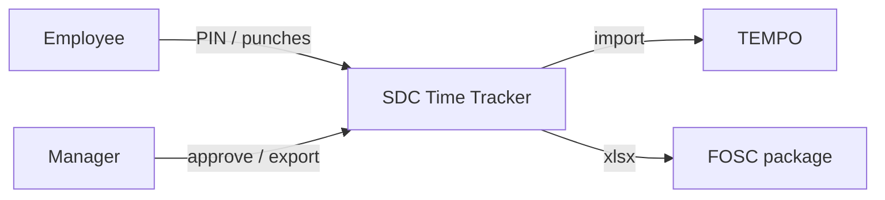

# Vision, Stakeholders & Needs

## Learning outcomes

- Write a **vision statement** that creates a shared perspective  
- List stakeholders and their **concerns**  
- **Derive needs** from the vision using the course grammar  
- Draw a simple **context diagram** and scope boundary  

## The place of vision in the chain

```text
VISION  →  NEEDS  →  USE CASES  →  REQUIREMENTS
              ↑ derives_from
```

This module covers **vision + stakeholders + needs**. Each need **derives_from** the vision (or a key principle). Use cases are the next module (`traces_to`); EARS requirements follow after that (`allocated_to`).

---

## Vision statement

### What it is

A **vision statement** describes the **desired future state** of the system or program phase — enough for leadership, operators, and engineers to share one mental model. It is broader than a single need and higher than any shall-requirement.

It often includes:

- **Scope of the phase** (what this increment extends or enables)  
- **Intended outcome** (decision superiority, auditability, speed, safety, …)  
- **Guiding principles** (e.g. human oversight, open standards, modularity, hybrid AI)  
- **Explicit non-goals** or constraints when known (optional but powerful)  

### Why it works (field experience)

On major SE efforts, starting with vision:

1. Gets **everyone on the same perspective** before debates about features  
2. Anchors **trade-offs** (“does this support the vision?”)  
3. Makes **phase boundaries** clear (Phase 1 foundations vs Phase 2 extension)  
4. Supplies language for **validation** with stakeholders  

Vision is used across industry (product vision, system vision, CONOPS-adjacent framing). Treat it as a **required baseline artifact** in this course, even when textbooks emphasize requirements first.

### Vision quality checklist

- [ ] A new engineer can read it and describe the program intent within 60 seconds  
- [ ] Ops and engineering would both recognize their world in it  
- [ ] It is **phase-aware** if you are in a refresh/increment (what continues, what is new)  
- [ ] Principles are **actionable** (they will ban or favor classes of design)  
- [ ] It does **not** replace needs or requirements (no “shall” laundry list)  

### Structure template


**Title:** Vision for <phase / system name>

**Vision body (1–2 paragraphs):**  
[Describe the future state, who it serves, and what capability class it creates. Mention any continuation from prior work.]

**Key principles (optional but recommended)**
- Principle 1: …
- Principle 2: …
- Principle 3: …


### Teaching example — AI-Augmented C2 (condensed, unclassified)

*Adapted from a real-style TR2 vision for classroom use — not a live program document.*

**Title:** AI-Augmented Command and Control (AIC2) Vision for Tech Refresh Phase 2

**Vision body (condensed):**  
The AIC2 vision for Tech Refresh Phase 2 (TR2) extends Phase 1 foundations—sensor interface integrations, cybersecurity alignment with recognized frameworks, and preparation for AI/ML in detection, identification, tracking, and prosecution—into a **hybrid human–AI ecosystem** that augments UAE AFAD command and control. The vision prioritizes **resilient, ethical AI** for decision superiority in multi-domain operations, **Combat Cloud–style** “any sensor, any shooter” flexibility where appropriate, and **operator oversight**, modularity, and adaptability in crowded UAE airspace. To promote interoperability and third-party evolution, AIC2 incorporates a **Modular Open Systems Approach (MOSA)** so modules can be developed, tested, and upgraded with loose coupling and open standards.

**Key principles (examples):**

1. **Hybrid algorithmic approaches** — Blend learning-based methods with physics-based / rule-based methods (e.g. neural robustness on clutter + deterministic models where physics dominate).  
2. **Graduated autonomy (OODA)** — From assisted observe/orient through recommended decide to configurable act, with human-in-the-loop for high-stakes actions.  
3. **Open standards for AI lifecycle** — Portable models, managed training/update pipelines, vendor-agnostic integration, continuous improvement on relevant data without locking the enterprise to one stack.  

### Mini vision (ETAS case study)

```text
SDC Time Tracker (ETAS) Vision

A single, trustworthy electronic time and attendance system for FOSC support staff:
employees check in and manage leave in seconds; managers approve exceptions with
full audit; program exports weekly and quarterly packages that reconcile to TEMPO
shortfalls — without rebuilding spreadsheets by hand.
```

### Workshop — draft a vision (15 min)

In pairs, write a **half-page vision** for either:

- A “Phase 2” of an app you know, or  
- A simple radar SA / C2 classroom system  

Include **two principles**. Peer: can they restate your vision without the paper?

---

## Stakeholders

A stakeholder is anyone who cares about the system’s success or failure.

| Stakeholder                     | Primary concern / goal                     | Cares about                                 |
|--------------------------------|--------------------------------------------|--------------------------------------------|
| Employee                       | Quick, accurate time capture               | Fast punch, leave balance, fair rules     |
| Manager                        | Oversight of staff time                    | Approvals, declared vs submitted time      |
| Program / FOSC admin           | Contract compliance & auditability          | Excel package, TEMPO shortfalls           |
| IT / security                  | Data protection and traceability           | PIN safety, audit trail                   |
| Mission operator (C2 example) | Situational awareness and decision support| SA quality, trust in AI aids, override    |
| Systems engineer                | Traceability, testability                 | Architecture consistency, verification    |


**Tip:** Vision usually names or implies primary stakeholders; list them explicitly next.

---

## Needs statement grammar

**Required form**

```text
As <stakeholder>,
we need <the need>,
so that <benefit>.
```

*The **need** must be expressed in the stakeholder’s operational language, not as a design choice (e.g., “use ONNX”).*


| Slot | What goes here |
|------|----------------|
| **As &lt;stakeholder&gt;** | Role, unit, or organization |
| **we need &lt;the need&gt;** | Capability / outcome in ops language |
| **so that &lt;benefit&gt;** | Mission or business value |

### Needs **derives_from** the vision

Do not invent needs in a vacuum. Walk the vision and ask:

1. Who must succeed for this vision to be real? → **stakeholders**  
2. What capability must they have? → **need**  
3. What mission outcome improves? → **benefit**  
4. Which vision line or **principle** does this need **derives_from**? (record the link)  

On multi-level visions, a system/phase vision may itself **derives_from** a global program vision before needs hang off the phase vision.

#### From AIC2-style vision → needs (examples)

```text
As UAE AFAD Mission Operators,
we need AI tools that combine smart learning with proven rules for better tracking,
identification, threat prediction, and engagement calculations,
so that we can handle dense threat environments and asymmetric threats.
```

*(Supports: hybrid algorithms + decision superiority in crowded airspace.)*

```text
As mission commanders,
we need graduated autonomy with operator approval on high-stakes actions,
so that we gain speed without surrendering accountability.
```

*(Supports: levels of autonomy / human-in-the-loop principle.)*

```text
As system integrators,
we need modular, open interfaces for sensors, effectors, and third-party AI models,
so that we can upgrade components without redesigning the entire C2 enterprise.
```

*(Supports: MOSA / open standards principle.)*

#### From ETAS vision → needs

```text
As FOSC program administrators,
we need electronic attendance with TEMPO-aware export under contract schedule rules,
so that we can produce auditable weekly and quarterly packages without manual rework.
```

```text
As SDC employees,
we need a fast PIN-based check-in and clear progress toward the daily target,
so that we spend time on the mission instead of fighting the timesheet.
```

### Quality checklist (needs)

- [ ] **derives_from** a vision phrase or principle (write the parent ID or one-line link)  
- [ ] Stakeholder is a real role/unit  
- [ ] Need is not a design (“use ONNX”) — that may be a principle or later requirement  
- [ ] Benefit is recognizable to that stakeholder  
- [ ] Not written as EARS/shall (that comes after use cases)  

### Need vs vision vs requirement

| Artifact | Answers |
|----------|---------|
| Vision | What future are we building (shared picture + principles)? |
| Need | Who needs what capability, so that what benefit? |
| Use case | How do they interact with the system to get value? |
| Requirement | What shall the system do (testable)? |

---

## Context diagram & boundary

Show actors, your system, external systems, labeled flows.



### Scope boundary

| In scope (example) | Out of scope (example) |
|--------------------|------------------------|
| - Check-in state machine<br>- BEOD credit rules | - Replacing TEMPO itself<br>- Payroll tax calculation |

Vision may **mention** enterprise themes (Combat Cloud, MOSA); scope decides what **this system** owns in this phase.

---

## Monday workshop (full set)

1. Half-page **vision** (+ 2 principles)  
2. Stakeholder table (≥ 4)  
3. **≥ 2 needs** in grammar, each linked to a vision line  
4. Context sketch + 3 in / 3 out of scope  

**Assignment A1 – Vision, Context & Stakeholders**

Submit a single document that includes:
1. A half‑page vision (including at least **two** key principles).  
2. A stakeholder table with **≥ 4** rows.  
3. **≥ 2** needs statements in the required grammar, each linked to a specific vision line.  
4. A context diagram (ASCII or Mermaid) plus a list of **≥ 3** in‑scope and **≥ 3** out‑of‑scope items.

All artifacts will be graded for traceability, completeness, and professionalism per the selection‑criteria rubric.

> **Reminder:** If you generate any wording with an AI tool, add an in-text citation (e.g., *Generated with ChatGPT, 2026*). The underlying idea and structure must still be yours.


## Next

**Use Cases from Needs** — turn each need into actor goals, main success scenarios, and extensions (where IF/THEN requirements are born).
