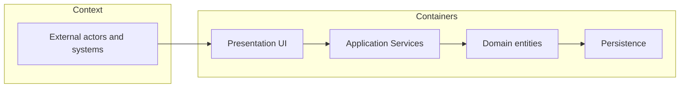

# Architecture Views

## Learning outcomes

- Describe a system with **layers / views**
- Allocate requirements to design elements
- Capture a **design decision** with rationale

## Architecture is not decoration

Architecture answers four essential questions:

- What are the major pieces?
- What are their responsibilities?
- How do they interact?
- What quality attributes does this structure support?

## Useful views for software-heavy systems (C4-style)

1. **Context** — system vs world (from prior module)  
2. **Containers / layers** — UI, application services, data  
3. **Components** — modules inside a layer  
4. **Runtime (sequence)** — who calls whom for a key scenario  

ETAS example layers:

| Layer          | Responsibility                 | Typical implementation artifact |
|----------------|--------------------------------|---------------------------------|
| Presentation   | Screens, forms                 | UI templates, route handlers    |
| Application services | Business rules            | Service classes (`time_state`, `time_calc`, `fosc_export`) |
| Domain         | Core entities                  | Entity classes (`Employee`, `TimeEntry`, `DailySummary`) |
| Persistence    | Storage of permanent data      | SQLite DB, ORM models            |


## Allocation (**allocated_to** design)

In the derivation chain, use cases are **allocated_to** requirements; here each requirement is **allocated_to** a design element.

| Requirement ID | **allocated_to** (design / code path) | Originating UC / Need |
|----------------|----------------------------------------|-----------------------|
| FR-CI-02 | `time_state.can_check_in` | UC-Check-In |
| FR-BEOD-01 | `time_calc.update_daily_summary` | Need-BEOD support |
| FR-DISC-01 | `fosc_export.write_discrepancy_sheet` | UC-Export package |

If you cannot place an FR (**allocated_to** nowhere), either the architecture is incomplete or the FR is not real.

## Design decision template

```text
Decision: Keep punch legality in a single service (`time_state`)
Status: **Approved** (reviewed 2026-08-05)
Rationale: Prevent UI and API from diverging on rules
Alternatives considered: Checks only in route handlers
Consequences: Routes stay thin; tests focus on one module; easier to extend legality logic
```

> **Reminder:** If any part of a decision record is generated with AI assistance, add an in-text citation (e.g., *Generated with ChatGPT, 2026*). The underlying rationale must remain yours.

## Workshop (10 min)

Pick one FR from the case study. Write:

1. The component that enforces it.  
2. The data it reads/writes.  
3. One risk if that component behaves incorrectly.

**Share** your answer in a 2‑minute stand‑up with the class.



*Alt text: Four-view C4-style stack — external actors into Presentation → Application services → Domain → Persistence.*

## Next

**Behavior — States & Sequences** — model states and sequences (runtime view) for time-dependent rules, showing how the architecture you just built is exercised.

