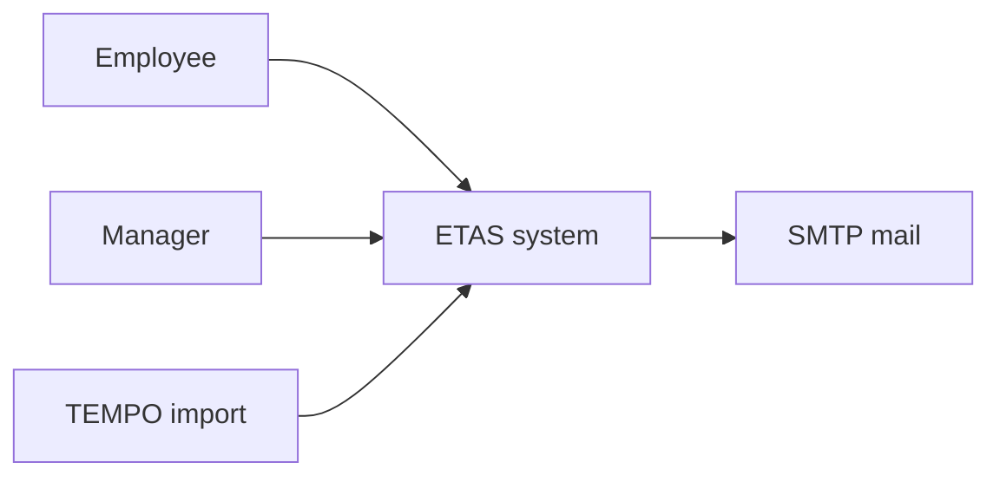
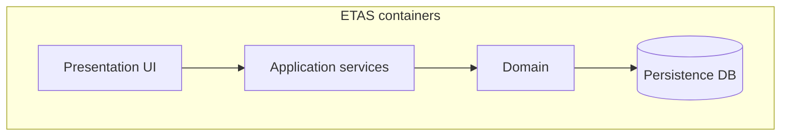
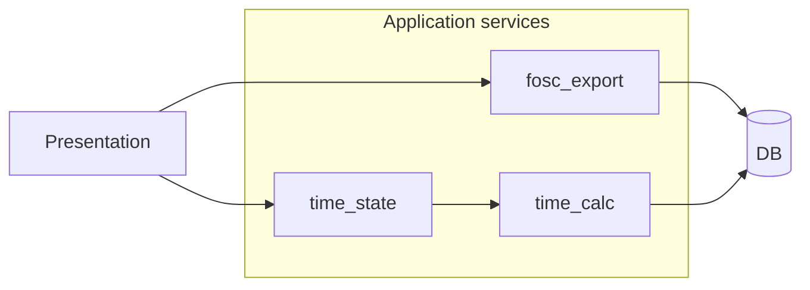
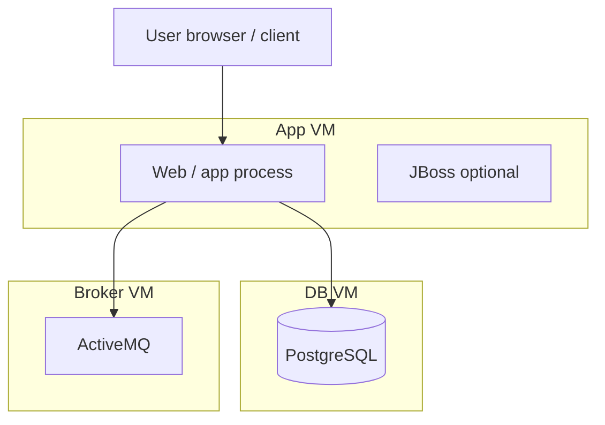
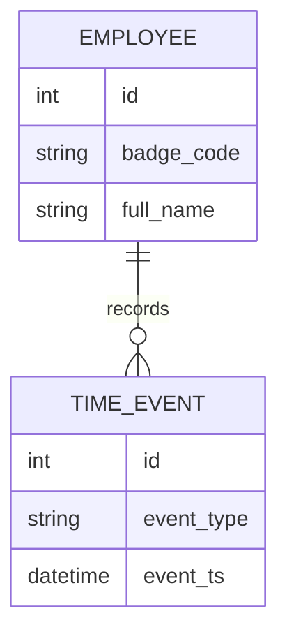

# Architecture Views

## Learning outcomes

After this module you can:

- Answer the four architecture questions for a software-heavy system  
- Choose an appropriate **view / diagram type** for a given question  
- Draw **context, container/layer, component, deployment, package, and data** sketches  
- **Allocate** requirements to design elements (`allocated_to`)  
- Capture a **design decision** with rationale  
- Recognize (at awareness level) **MBSE, UML, SysML, and architecture frameworks** — details in the follow-on module  

## Architecture is not decoration

Architecture answers four essential questions:

| Question | Typical view |
|----------|----------------|
| What are the major pieces? | Context, container, component |
| What are their responsibilities? | Layer/component tables + notes |
| How do they interact? | Connectors on structure; **sequences** in se-06 |
| What qualities does this structure support? | Decisions + NFRs (perf, security, deployability) |

**Rule:** one diagram cannot answer every question. Use **multiple views** of the same system.

SE link: after requirements exist, each FR should be **allocated_to** a design element. If you cannot place an FR, the architecture is incomplete or the FR is not real.

---

## Diagram catalog (course toolkit)

Examples use the **ETAS / time-tracker** case and **VM-based** deployment (course lab standard — not Docker).

### 1. Context diagram — system vs world

**Use when:** you need the boundary and external actors/systems (pairs with se-02).



*Alt text: Employees and managers use ETAS; TEMPO feeds in; ETAS sends mail.*

| Include | Exclude |
|---------|---------|
| Actors and external systems that exchange data or control | Internal modules (`time_state`, routers) |
| Direction of major flows | Protocol field layouts (that is the ICD — se-07) |

---

### 2. Container / layer view (C4 “containers”)

**Use when:** you need runnable or deployable major pieces and their responsibilities.



| Layer | Responsibility | Example artifacts |
|-------|----------------|-------------------|
| Presentation | Screens, forms, routes | Templates, route handlers |
| Application services | Business rules | `time_state`, `time_calc`, `fosc_export` |
| Domain | Core entities | `Employee`, `TimeEntry` |
| Persistence | Durable storage | SQLite/Postgres schema, ORM |

C4 names this level **containers** (not Docker — “application or data store that executes/stores”). On this program, containers often map to **processes on VMs**.

---

### 3. Component view — modules inside a container

**Use when:** allocating FRs to services/modules inside the application layer.



| Component | Owns |
|-----------|------|
| `time_state` | Punch legality (check-in / check-out rules) |
| `time_calc` | Daily summaries |
| `fosc_export` | Contract workbook generation |

---

### 4. Deployment view — where it runs

**Use when:** NFRs for availability, network path, or ops handoff; matches admin/VM reality.



| Ask | Example |
|-----|---------|
| Same VM or split? | App and DB on different VMs → network + `pg_hba` + firewall |
| Single point of failure? | One broker VM |
| What does ops restart? | `systemctl` units on which guest |

---

### 5. Package / module view — code ownership

**Use when:** repository layout, team boundaries, or “where does this class live?”

```text
com.ciss.etas
  web/          presentation
  service/      application services
  domain/       entities
  persist/      repositories / JDBC
```

Keep package diagrams **coarse**. Fine class diagrams are optional; prefer a short table of packages → responsibilities.

---

### 6. Information / data sketch

**Use when:** entities and relationships matter to FRs (not a full enterprise data model).



Trace: uniqueness of `badge_code` may support an FR about identity; do not invent tables with no requirement.

---

### 7. Behavior views (pointer — not this module’s drill)

| View | Module | Role |
|------|--------|------|
| **State machine** | **se-06** | Legal/illegal modes over time |
| **Sequence diagram** | **se-06** | Message order for one scenario |

Architecture defines *who exists*; behavior shows *how they exercise* a use case. Keep them consistent with the same FR IDs.

---

### 8. Interface view (pointer)

External contracts (TEMPO file, FOSC export, JMS payload) belong in **se-07 Interfaces & ICDs**. On a component diagram you may label a connector “TEMPO CSV”; the field list lives in the ICD.

---

## Choosing a diagram (decision table)

| You need to explain… | Draw |
|----------------------|------|
| Who is outside the system | Context |
| Major running pieces / layers | Container / layer |
| Which module owns an FR | Component + allocation table |
| VMs, processes, network hops | Deployment |
| Repo / package structure | Package sketch |
| Data entities | ER / data sketch |
| Order of calls for a scenario | Sequence (**se-06**) |
| Allowed modes / rejects | State (**se-06**) |
| Wire/file/API contract | ICD (**se-07**) |

**Anti-pattern:** one mega-diagram that mixes UI widgets, SQL columns, VM names, and sequence arrows. Split views.

---

## Allocation (`allocated_to` design)

| Requirement ID | **allocated_to** (design / code path) | Originating UC / Need |
|----------------|----------------------------------------|-----------------------|
| FR-CI-02 | `time_state.can_check_in` | UC-Check-In |
| FR-BEOD-01 | `time_calc.update_daily_summary` | Need-BEOD support |
| FR-DISC-01 | `fosc_export.write_discrepancy_sheet` | UC-Export package |

Every critical FR should appear in **at least one** structural view and, when time-dependent, a behavior view.

---

## Design decision template

```text
Decision: Keep punch legality in a single service (time_state)
Status: Approved (reviewed 2026-08-05)
Rationale: Prevent UI and API from diverging on rules
Alternatives considered: Checks only in route handlers
Consequences: Routes stay thin; tests focus on one module; easier to extend legality logic
```

> If any part of a decision record is generated with AI assistance, add an in-text citation. The rationale must remain yours.

---

## Landscape map (awareness only)

You will hear these terms on real programs. **This course does not require tool proficiency in them.** Deep literacy is **Architecture Frameworks & MBSE** (se-11).

| Term | One-line meaning |
|------|------------------|
| **UML** | General-purpose modeling language (class, sequence, state, …) — software-centric |
| **SysML** | UML profile for systems (structure, behavior, requirements, parametrics) |
| **MBSE** | Model-based systems engineering — the *model* is a primary authority, not only documents |
| **DoDAF / MODAF / NAF / UAF** | Architecture *frameworks* — named views/products for enterprise & defense programs (e.g. OV-1) |
| **C4** | Lightweight software architecture views (context → container → component → code) |

| Course artifact | Framework-ish cousin |
|-----------------|----------------------|
| Context diagram | Operational context / OV-1 style picture |
| Container + deployment | Resource / system views |
| Sequence + state | Behavioral views |
| ICD | Interface products |
| RTM (se-08) | Requirements trace views |

**Course stance (unchanged):** simplest clear tool that a peer can review — Mermaid, PlantUML, draw.io, markdown tables. Enterprise MBSE tools are a career skill, not a Monday gate.

---

## Workshop (20–25 min)

Using ETAS or a tiny system of your choice:

1. Sketch a **context** diagram (5 min).  
2. Sketch a **container/layer** or **component** view (5 min).  
3. Sketch a **deployment** view assuming **two VMs** (app + DB) (5 min).  
4. Allocate **one FR** to a component; write one **design decision** line (5 min).  

Share in a short stand-up: which view was hardest and why.

## Thursday assignment

**SE-A05 — Architecture Views & Allocation** (see Assignments). Assigned this Monday. Due Thursday.

Same Thursday as **A2 final**. Keep views **coarse** — context, one structure view, VM deployment, five FR allocations, one decision. Do not rebuild A2.

---

## Tools for these artifacts

| Artifact | Simplest clear tools | Enterprise class |
|----------|----------------------|------------------|
| Context / container / component | Mermaid, draw.io, C4-PlantUML | Rhapsody, Cameo, Capella |
| Deployment | Mermaid, draw.io | Same + infra diagrams |
| Allocation matrix | Markdown or Excel | DOORS/Jama links + model |
| Design decision | Markdown ADR | Wiki + CM |

| Topic | Link |
|-------|------|
| C4 model | [c4model.com](https://c4model.com/) |
| C4-PlantUML | [GitHub C4-PlantUML](https://github.com/plantuml-stdlib/C4-PlantUML) |
| Mermaid | [mermaid.js.org](https://mermaid.js.org/) |
| SEBoK architecture | [System Architecture Design Definition](https://sebokwiki.org/wiki/System_Architecture_Design_Definition) |

## Further reading

| Topic | Source |
|-------|--------|
| C4 model | [c4model.com](https://c4model.com/) |
| Architecture definition | [SEBoK — System Architecture Design Definition](https://sebokwiki.org/wiki/System_Architecture_Design_Definition) |
| Decision management | [SEBoK — Decision Management](https://sebokwiki.org/wiki/Decision_Management) |
| Deployment thinking | Admin track **vSphere / VMs**; SW track multi-VM Postgres/ActiveMQ |
| Frameworks & MBSE | Course module **Architecture Frameworks & MBSE Literacy** |

## Next

**Behavior — States & Sequences** — runtime views that exercise the structure you just defined.

*(Later: **Architecture Frameworks & MBSE Literacy** — UML/SysML/DoDAF/MODAF map after you have structure, behavior, and ICDs.)*
