# Behavior — States & Sequences

## Learning outcomes

After this module you can:

- Build a **state machine** using states, triggers, guards, and activities  
- Map **EARS requirements** to transitions (and back)  
- Model **hierarchical (composite) states** without losing illegal-path clarity  
- Draw a **sequence diagram** for a scenario consistent with the state model  
- Annotate behavior views with **FR IDs** for V&V  

## Why behavior models?

Requirements say *what*. Behavior models show *when*, *under what conditions*, and *in what order*. Many defects are illegal sequences (“check out without check-in”) or missing guards (“approve when already rejected”).

| Artifact | Answers |
|----------|---------|
| EARS FR | What the system shall do in a situation |
| State chart | Modes the system (or entity) can be in; legal moves |
| Sequence diagram | Who talks to whom for one scenario |

---

## State machine vocabulary (learn these terms)

| Term | Meaning | Notation (UML / common) |
|------|---------|-------------------------|
| **State** | A lasting condition that matters to behavior | Rounded rectangle / node name |
| **Initial state** | Where the machine starts | Filled black circle → |
| **Final state** | Terminal (if used) | Bullseye |
| **Transition** | Allowed move from current → next state | Arrow |
| **Trigger (event)** | What causes the transition to be considered | Label on arrow, e.g. `check_in` |
| **Guard** | Boolean condition that must be true | `[declared >= check_in]` |
| **Activity / effect** | Action on the transition or inside the state | `/ log_event` or `entry / reserve` |
| **Entry activity** | Runs when entering a state | `entry / …` |
| **Exit activity** | Runs when leaving a state | `exit / …` |
| **Do activity** | Ongoing while in the state | `do / …` |
| **Composite (hierarchical) state** | State that contains substates | Nested region |
| **History** (optional) | Resume last substate | `H` / `H*` |

### Canonical transition label

```text
trigger [guard] / activity
```

Examples:

```text
check_out [declared_time >= check_in_time] / write_checkout_event
approve [balance_ok] / notify_employee
timeout / mark_overdue
```

If the trigger fires but the **guard is false**, the transition does **not** fire (system stays in current state — usually after an explicit reject/error path if the FR requires feedback).

### Reject / illegal paths

Show them. Options:

1. Self-transition with `/ reject` activity  
2. Transition to an `Error` or `Rejected` state  
3. Note on the diagram: “event X in state Y → no transition; return error E”

Silent ignore of illegal events is a design choice — if an FR says the system **shall** notify the user, you need a visible path.

---

## Syntax cheat-sheet (Mermaid and PlantUML)

### Mermaid (course site friendly)

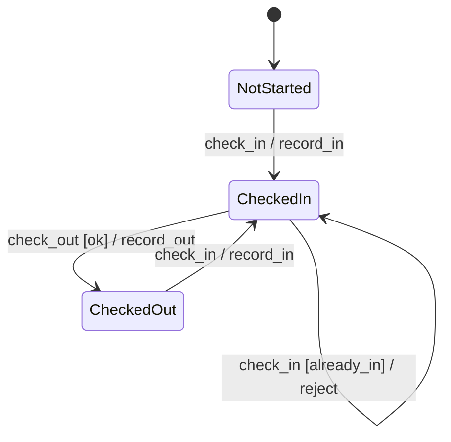

### PlantUML (UML-like labels)

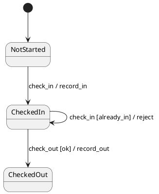

### SysML / tool-style (same semantics)

SysML state machines use the same UML state-machine semantics. In Cameo/Rhapsody you still model **states, triggers, guards, effects**. Course deliverables may use Mermaid, PlantUML, draw.io, or exported SysML diagrams — **labels must stay readable** (trigger, guard, activity, FR IDs).

---

## Mapping EARS → state charts

EARS patterns are almost a direct translation into transitions.

| EARS pattern | State-chart reading |
|--------------|---------------------|
| **WHEN** *trigger* THE SYSTEM SHALL *response* | Trigger on a transition; activity = response |
| **WHILE** *in condition* … | Often: **guard** or **being in a state** |
| **IF** *precondition* THEN … | **Guard** on the transition |
| **WHERE** *feature* … | Scope: which machine / which composite state |
| **Ubiquitous** (always) | Invariant: every state must allow/forbid something consistently |

### Worked map — punch legality

| FR ID | EARS (short) | State element |
|-------|--------------|---------------|
| FR-CI-01 | WHEN employee requests check-in AND not already checked in, ETAS shall create a check-in event | `NotStarted`/`CheckedOut` → `CheckedIn` on `check_in` / `record_in` |
| FR-CI-02 | IF already checked in THEN ETAS shall reject check-in and notify | Self-transition or stay + `/ reject` with guard `[already_in]` |
| FR-CO-01 | WHEN check-out requested WHILE checked in AND declared ≥ in, shall record check-out | `CheckedIn` → `CheckedOut` : `check_out [ok] / record_out` |
| FR-CO-02 | IF declared < check-in THEN shall reject | Guard false path / reject |

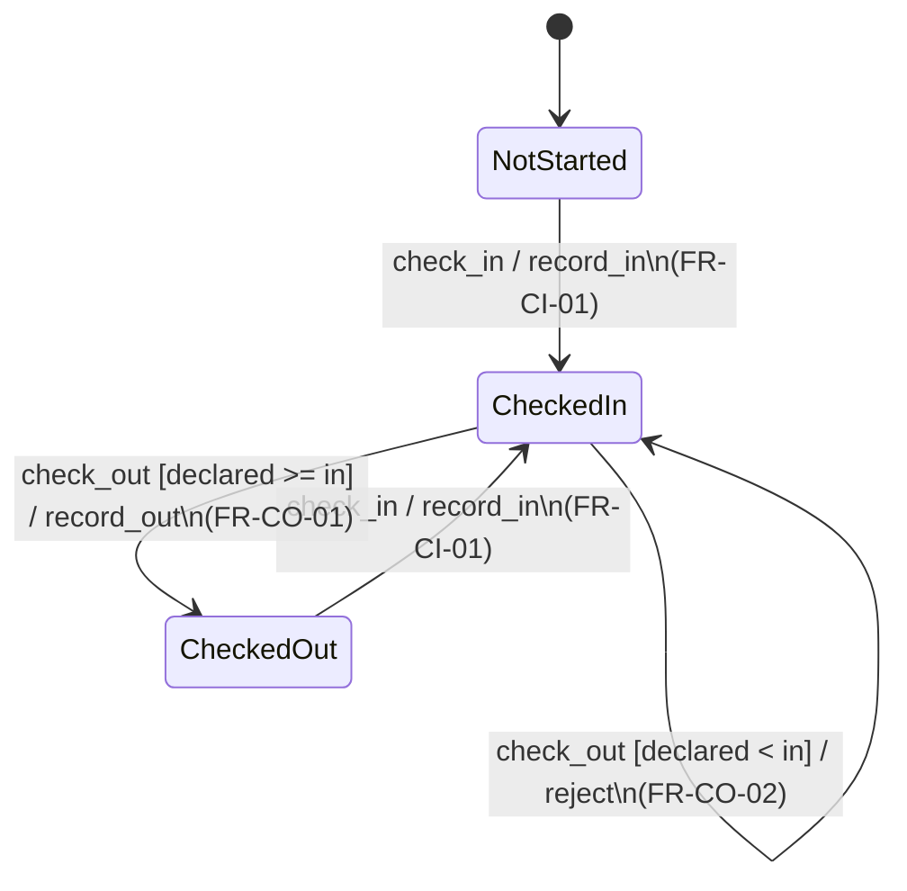

**Method (use on every assignment):**

1. List candidate **states** (nouns/modes in the FRs).  
2. For each FR, underline **trigger**, **guard/condition**, **shall action**.  
3. Draw the transition; put the **FR ID** on the arrow or in a mapping table.  
4. For each state, list events that must be **rejected** — add explicit paths.  
5. Walk a scenario: does the chart allow an illegal real-world sequence?

---

## Example gallery (flat machines)

### 1. ETAS daily punch (reference)

States: `NotStarted`, `CheckedIn`, `CheckedOut`.  
Triggers: `check_in`, `check_out`.  
Guards: time order, already-in.  
Activities: record event, reject+notify.

### 2. Leave request

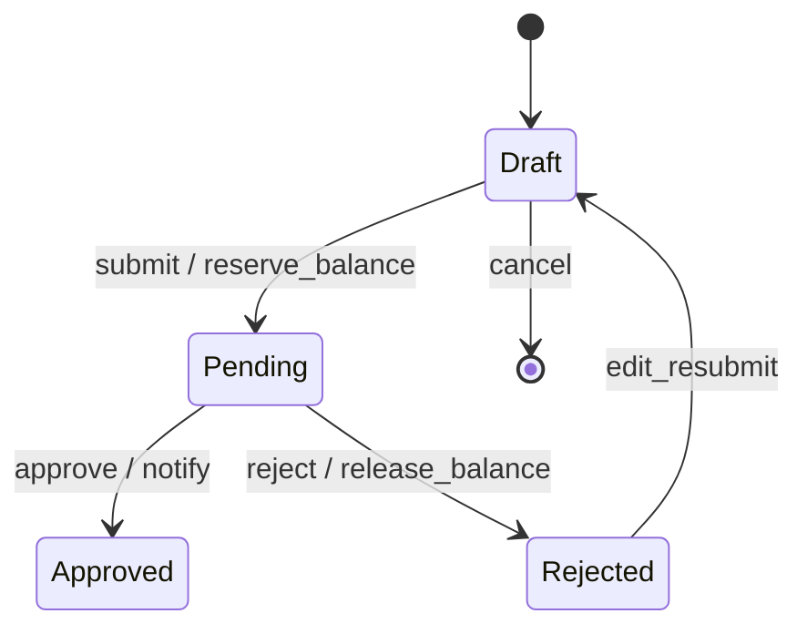

| FR-style rule | Element |
|---------------|---------|
| WHILE pending, balance is reserved | `entry` on Pending or activity on `submit` |
| IF reject THEN release reservation | `/ release_balance` on reject transition |

### 3. Library book

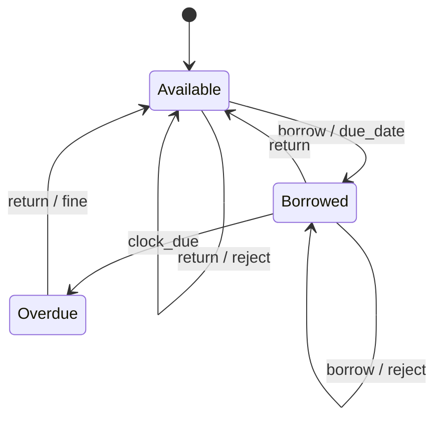

### 4. Door access (simple security)

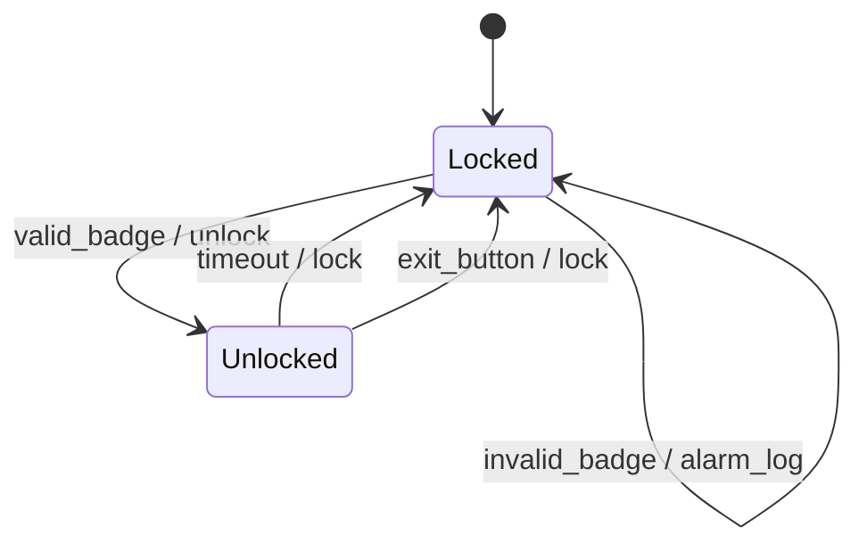

### 5. Job / ticket lifecycle (ops-adjacent)

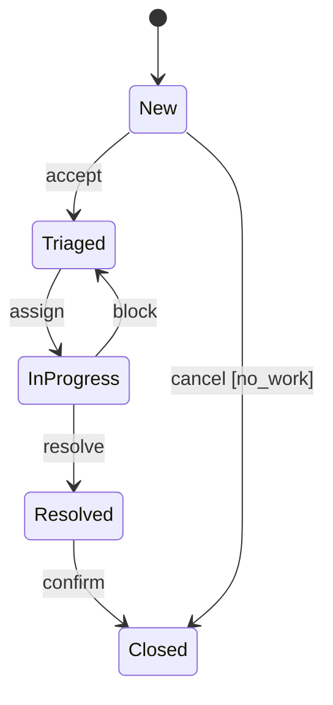

### 6. Connection / session (middleware-flavored)

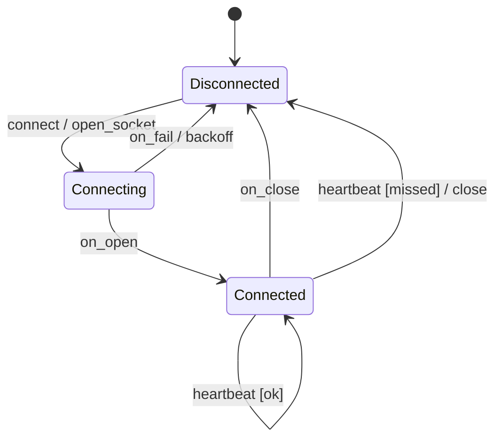

---

## Hierarchical (composite) states

When many transitions share the same behavior, nest **substates** inside a **superstate**.

### Why hierarchy?

| Flat problem | Hierarchy helps |
|--------------|-----------------|
| Same `cancel` from five states | One transition from the composite border |
| “Powered on” vs detailed mode | Superstate `PoweredOn` with substates `Idle` / `Busy` |
| Cluttered diagrams | Group related modes |

### Example — traffic light (teaching classic)

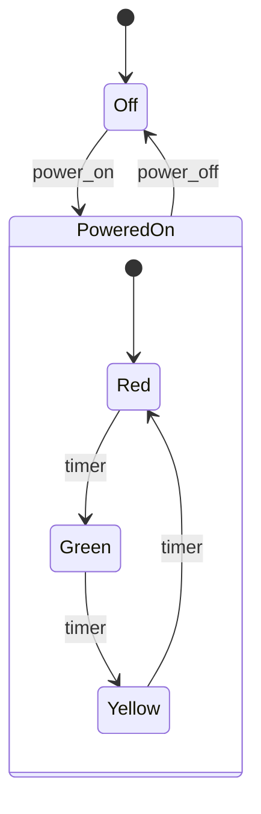

`power_off` from **any** substate of `PoweredOn` goes to `Off` without drawing three arrows — that is the point of the composite.

### Example — ETAS shift with hierarchy

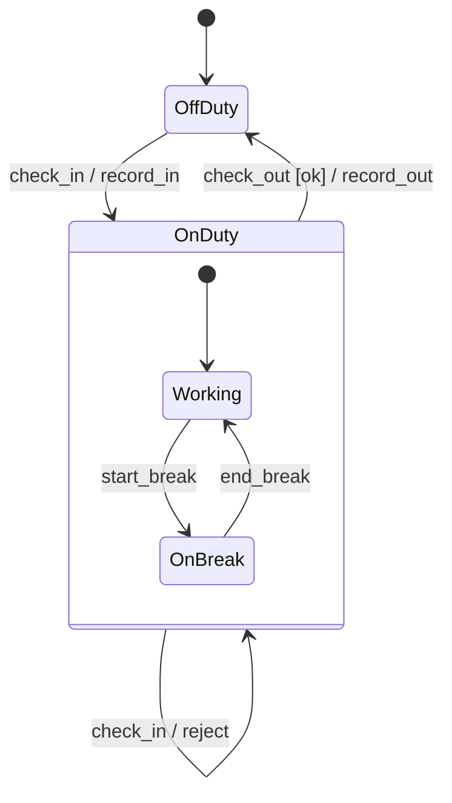

| Idea | Modeling |
|------|----------|
| Must be checked in to take a break | `start_break` only inside `OnDuty` |
| Check-out ends all on-duty substates | Transition from composite `OnDuty` → `OffDuty` |

### Example — sensor track (SA-flavored, unclassified)

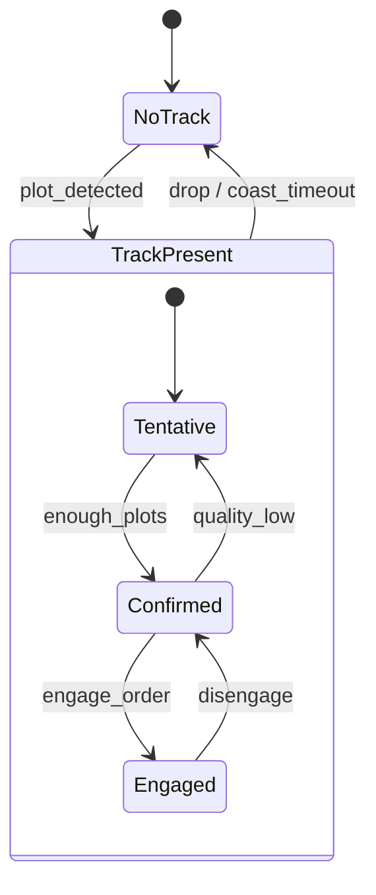

### Pitfalls with hierarchy

1. **Hidden illegality** — still list rejects for events that arrive in the wrong substate.  
2. **Over-nesting** — more than two levels is rarely needed for course work.  
3. **Unclear initial substate** — always mark `[*] --> …` inside the composite.  
4. **FR orphan** — every FR still maps to a transition or a state’s entry/exit; hierarchy is not an excuse for missing guards.

---

## Sequence diagrams (runtime collaboration)

State charts: modes of **one** entity. Sequences: messages among **actors/components** for one use-case path.

### Tips

- **5–12 messages**; one primary scenario per diagram.  
- Use `alt` / `opt` for success vs reject.  
- Every message justified by an FR or ICD.  
- State chart and sequence must **agree** (no sequence that the chart forbids).

### Example — check-in success vs reject

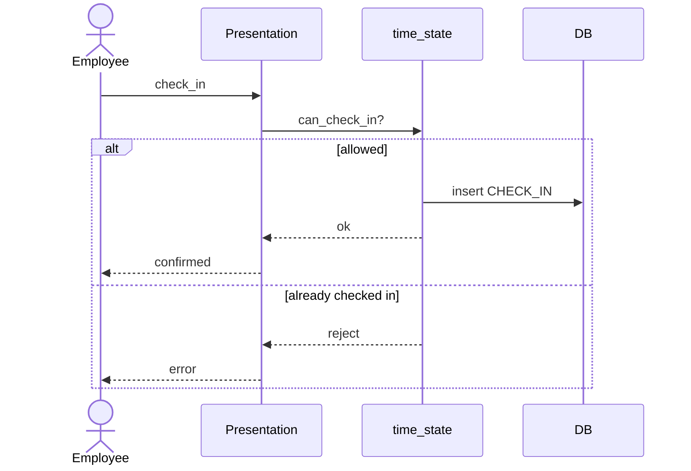

---

## Consistency rules

1. Every sequence message allowed by some FR or interface.  
2. Every critical FR appears on a transition, guard, or entry/exit activity.  
3. Illegal events are explicit (reject path or documented “no effect”).  
4. Hierarchical charts still need a **flat mapping table** FR → element for graders.  
5. Activities that change data should name the effect (`/ record_in`), not hide side effects in state names only.

---

## Graded work (this module)

| ID | Focus |
|----|--------|
| **A3** | Your feature: **one state chart + one sequence** + FR map |
| **A3b** | Given **EARS set** → **flat** state chart + mapping table |
| **A3c** | Given **system description** → **hierarchical** state chart + mapping table |

Tools: Mermaid, PlantUML, draw.io, Visio, or SysML tool export. Annotate **FR IDs**.

---

## In-class drills (not graded)

**Drill 1 (10 min)** — Library book FRs → chart (gallery #3). Peer-check rejects.  
**Drill 2 (10 min)** — Rewrite leave request with entry/exit activities.  
**Drill 3 (15 min)** — Flatten the hierarchical ETAS OnDuty chart; count arrows saved by composite.

> AI-assisted labels: cite the tool. Structure and FR mapping must be yours.

---

## Tools for these artifacts

| Artifact | Simplest clear tools | Enterprise / SysML |
|----------|----------------------|--------------------|
| State machine | Mermaid `stateDiagram-v2`, PlantUML, draw.io | Cameo / Rhapsody state machines |
| Sequence | Mermaid / PlantUML | Same |
| FR mapping table | Markdown or Excel | Model links to req DB |

| Topic | Link |
|-------|------|
| Mermaid states | [State diagrams](https://mermaid.js.org/syntax/stateDiagram.html) |
| PlantUML states | [PlantUML state](https://plantuml.com/state-diagram) |
| UML state machines | [uml-diagrams.org — state](https://www.uml-diagrams.org/state-machine-diagrams.html) |
| UML sequence | [uml-diagrams.org — sequence](https://www.uml-diagrams.org/sequence-diagrams.html) |
| SysML | [OMG SysML](https://www.omgsysml.org/) |

## Further reading

| Topic | Source |
|-------|--------|
| State machines | [UML State Machine Diagrams](https://www.uml-diagrams.org/state-machine-diagrams.html) |
| Sequence diagrams | [UML Sequence Diagrams](https://www.uml-diagrams.org/sequence-diagrams.html) |
| EARS | Course **Requirements** module |
| MBSE context | **Architecture Frameworks & MBSE Literacy** |

## Next

**Interfaces & ICDs** — contracts on the messages your sequences already assumed.
