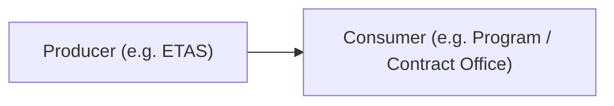

# Interfaces & ICDs

## Learning outcomes

- Identify external interfaces  
- Write a lightweight **interface description**  
- Explain why formula/layout changes are interface changes  

## Interfaces are contracts

When two systems (or human + system) meet, you need agreement on:

| Topic | Questions | Typical answer (example) |
|-------|-----------|--------------------------|
| Purpose | Why does this exchange exist? | Export weekly FOSC package for contract reporting |
| Parties | Who is producer / consumer? | Producer: ETAS; Consumer: Program / contract office |
| Content | What data / commands are exchanged? | Excel workbook with timekeeping sheet, discrepancy tracker |
| Format | File, API, radio voice, message type? | XLSX file, specific sheet/tab naming convention |
| Timing | On demand, daily, real-time? | Generated every Thursday night (weekly) |
| Errors | What if missing / late / invalid? | Export fails → error notification to manager |
| Security | Who is allowed? | Authenticated ETAS service only; file protected at rest |

That agreement is the heart of an **ICD** (Interface Control Document), even if yours is one page.

## ETAS examples

| Interface | Producer → Consumer | Notes (data type / cadence) |
|-----------|---------------------|------------------------------|
| TEMPO import | Manager → ETAS | CSV file, weekly Monday-keyed hours |
| FOSC Excel export | ETAS → Program / contract package | XLSX workbook, fixed sheet names, column M variance |
| SMTP email | ETAS → employee/manager mail | Optional, uses configured SMTP server |
| Human PIN UI | Employee → ETAS | Web UI, session cookie after PIN verification |



*Alt text: Generic producer → consumer interface flow.*

### Teaching example — Discrepancy Tracker

The contract workbook expects:

- **Tab naming**: `Time Keeping Sheet (WkN)`  
- **Variance column**: **column M** (numeric)  
- **Formula layout**: `INDEX/MATCH` with a row offset  

If you move the variance to **column N**, that is an **interface change** because it alters the **Format / schema** field of the ICD. All downstream code, automated tests, and user training must be updated together.

## Lightweight ICD template (use this)

```text
Interface name:
Version:          (e.g. 1.0)
Provider:
Consumer:
Operation / data:      (what the interface does / what data it carries)
Format / schema:       (file type, message structure, field definitions)
Frequency:             (on-demand, daily, weekly, real-time)
Success criteria:      (what constitutes a successful exchange)
Error handling:        (how to report and recover from failures)
Security / auth:       (who may use it, encryption, authentication)
Owner:                 (person / team responsible for the interface)
```

## Workshop (10 min)

Write a **mini-ICD** for either:

- **TEMPO weekly import**, or  
- **FOSC weekly export**  

Use the template above, fill in at least the first six fields, and note any **interface change impact** (e.g. file layout, schema version).

**Share** your draft in a 2-minute read-out with the class.

> **Reminder:** If any part of an ICD (field descriptions, success criteria, etc.) is generated with AI assistance, add an in-text citation (e.g., *Generated with ChatGPT, 2026*). The underlying decisions must remain yours.

## Further reading

| Topic | Source |
|-------|--------|
| Interface management | [SEBoK search — interface management](https://sebokwiki.org/wiki/Special:Search?search=interface+management) |
| System integration | [SEBoK search — system integration](https://sebokwiki.org/wiki/Special:Search?search=system+integration) |
| ICD practice (accessible overview) | Search “Interface Control Document best practices” + [NASA SE Handbook](https://www.nasa.gov/reference/systems-engineering-handbook/) interface sections |
| API design as ICD analogue | [Microsoft REST API Guidelines](https://github.com/microsoft/api-guidelines) (software-facing, good contract thinking) |
| Data contracts / schemas | [JSON Schema](https://json-schema.org/) (optional technical deep dive) |
| Change control | [SEBoK — Configuration Management](https://sebokwiki.org/wiki/Configuration_Management) |

## Next

**Verification, Validation & Traceability** — verify that each external interface meets the success criteria you defined here, and that every requirement links to a concrete test.
