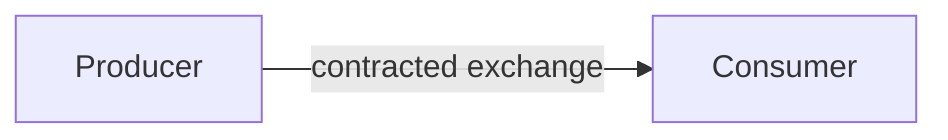

# Interfaces & ICDs

## Learning outcomes

After this module you can:

- Explain an **ICD** as a versioned contract between producers and consumers  
- Distinguish **messaging ICDs** from **API (e.g. REST) ICDs**  
- Sketch messaging ICD pieces: **message content**, **Tx/Rx matrix** (transmit / receive / process / drop), **rate table**  
- Sketch API ICD pieces: **operations**, **parameters**, **returns**, **error codes**  
- Recognize **ASTERIX** (e.g. Cat 062) as a real surveillance messaging standard  
- Describe how **primes and subcontractors** use ICDs under contract  
- Evaluate whether “the subcontractor shall implement the ICD” is a sufficient requirement  
- Spot when a layout or field change is an **interface change**  

## Interfaces are contracts

When two systems (or human + system) meet, you need agreement on:

| Topic | Questions |
|-------|-----------|
| Purpose | Why does this exchange exist? |
| Parties | Who is producer / consumer? |
| Content | What data or commands are exchanged? |
| Format | Message, file, HTTP body, voice, …? |
| Timing / rate | On demand, periodic, event-driven? |
| Errors | Invalid, late, unauthorized — what happens? |
| Security | Who may use it; encryption; auth |

That agreement is an **ICD** (Interface Control Document), whether one page or a EUROCONTROL specification.



---

## Two ICD families (course focus)

| | **Messaging ICD** | **API ICD** |
|--|-------------------|-------------|
| Style | Often **push**: producer emits messages on a link/bus | Often **request/response**: client calls server |
| Unit of exchange | **Message type** (category, opcode, topic, …) | **Operation** (HTTP method + path, RPC, …) |
| Core tables | Message content; **who Tx / Rx**; process vs drop; **how often** | Parameters; return body; **error codes** |
| Timing | Rates, periods, event triggers | Latency budgets, timeouts, idempotency |
| CISS-flavored example | **ASTERIX Cat 062** system track messages | **REST** attendance or track-query API |
| SW track cousin | ActiveMQ / JMS payloads | HTTP services, OpenAPI |

Both are still ICDs: change the contract without telling the other side and integration breaks (Mars Climate Orbiter lesson — units and schemas).

---

## Messaging ICDs

Typical structure for radar / C2 / track data links:

1. **Scope & version** — document ID, edition, applicability  
2. **Message catalog** — list of message types  
3. **Message content** — fields, types, units, optional vs mandatory  
4. **Tx/Rx matrix** — which nodes may **transmit**, **receive**, **process**, or **drop**  
5. **Rate / periodicity** — how often each message (or class) is sent  
6. **Error / invalid handling** — malformed, unknown type, out-of-order  
7. **Transport notes** — UDP/TCP, multicast group, encoding (binary, endianness)

### Message content (partial teaching example)

Illustrative **system track** fields inspired by surveillance exchange practice — **not** a substitute for the official ASTERIX spec:

| Field / item (teaching ID) | Meaning | Type / notes |
|----------------------------|---------|--------------|
| `MSG_TYPE` | Category / message class | e.g. system track |
| `SAC` / `SIC` | System area / ID codes | Identify data source |
| `TRACK_NUM` | Track identity | Integer |
| `TOD` | Time of day | Spec-defined encoding |
| `LAT` / `LON` | Position | WGS-84; **units and LSB in real ICD** |
| `ALT` | Mode C / geometric altitude | Units matter |
| `VX` / `VY` | Velocity components | Optional in some profiles |
| `MODE3A` | Squawk | Octal digits as specified |
| `CALLSIGN` | Aircraft ID | When available |

Real ASTERIX documents define **data items** (e.g. I062/xxx), presence via **Field Specification (FSPEC)**, and precise encoding. Program work uses the **edition** your system is certified against.

### Tx / Rx / process / drop matrix (partial example)

| Node | Cat 062 system track | Local sensor plots | Own maintenance msg |
|------|----------------------|--------------------|---------------------|
| **SDPS / tracker** | **Tx** (originator) | Rx → process | Tx / Rx |
| **C2 display** | **Rx → process** (display / correlate) | Drop or limited | Drop |
| **Recording / debrief** | Rx → process (store) | Rx → store | Rx → store |
| **Foreign gateway** | Rx → process **or drop** per filter policy | Drop | Drop |
| **Unrelated workstation** | **Drop** | Drop | Drop |

| Action | Meaning |
|--------|---------|
| **Tx** | Allowed to originate this message on the interface |
| **Rx** | Allowed to receive it on the wire |
| **Process** | Shall parse and use the content (not only pass through) |
| **Drop** | May ignore (or must ignore) — document which |

Ambiguous “everyone gets everything” is not an ICD. Filters and classification rules belong here or in a referenced security/ICD annex.

### Rate / periodicity table (partial example)

| Message / class | Nominal rate | Trigger | Notes |
|-----------------|--------------|---------|-------|
| System track update (active track) | ~1 Hz per track (example) | Periodic while track live | Real systems: profile-dependent |
| Track begin | Event | Track initiation | Burst on create |
| Track end / drop | Event | Coast timeout / delete | |
| Status / heartbeat | 0.1–1 Hz (example) | Periodic | Link liveliness |

Rates drive bandwidth, CPU, and “is the feed stale?” NFRs. Put numbers in the ICD or a linked performance annex.

### ASTERIX Category 062 (real standard pointer)

**ASTERIX** (All Purpose Structured EUROCONTROL Surveillance Information Exchange) is the European standard family for surveillance data exchange.

| Item | Fact |
|------|------|
| **Cat 062** | **SDPS track messages** (system track data to users) |
| Publisher | EUROCONTROL |
| Spec family | EUROCONTROL Specification for Surveillance Data Exchange |
| Public entry | [CAT062 on eurocontrol.int](https://www.eurocontrol.int/publication/cat062-eurocontrol-specification-surveillance-data-exchange-asterix-part-9-category-062) |
| Related | **Cat 021** — ADS-B target reports ([CAT021](https://www.eurocontrol.int/publication/cat021-eurocontrol-specification-surveillance-data-exchange-asterix-part-12-category-21)); ASTERIX Part 1 — overall encoding rules |

Course use: **structure of a messaging ICD**, not memorizing every I062 item. Official PDFs are the authority for implementation.

---

## API ICDs (REST client–server example)

Typical structure:

1. Base URL, auth, versioning strategy  
2. **Operations** — method, path, purpose  
3. **Request parameters** — path, query, headers, body schema  
4. **Success response** — status code, body schema  
5. **Error codes** — status + application error body  
6. Idempotency, pagination, rate limits (as needed)

### Partial REST example — lab time service

**Base:** `https://etas-lab.example.local/api/v1`  
**Auth:** Bearer token (lab); production per security ICD

| Operation | Method | Path | Purpose |
|-----------|--------|------|---------|
| Check in | `POST` | `/employees/{badge}/check-in` | Record check-in if legal |
| Check out | `POST` | `/employees/{badge}/check-out` | Record check-out if legal |
| Get status | `GET` | `/employees/{badge}/punch-state` | Current punch **state** |

#### `POST /employees/{badge}/check-in`

| | Detail |
|--|--------|
| Path param | `badge` (string, required) |
| Body (JSON) | `{ "declaredAt": "<ISO-8601 optional>" }` |
| Success | `201 Created` — `{ "eventId": "…", "state": "CheckedIn" }` |
| Errors | See table below |

| HTTP | App code | When |
|------|----------|------|
| 400 | `INVALID_BADGE` | Malformed badge |
| 401 | `UNAUTHORIZED` | Missing/bad token |
| 409 | `ALREADY_CHECKED_IN` | Illegal in current state |
| 503 | `SERVICE_UNAVAILABLE` | DB down |

#### `GET /employees/{badge}/punch-state`

| | Detail |
|--|--------|
| Success | `200` — `{ "badge": "…", "state": "CheckedIn" \| "CheckedOut" \| "NotStarted" }` |
| Errors | `404 NOT_FOUND`, `401 UNAUTHORIZED` |

**OpenAPI** can express the same contract machine-readably; the **ICD** still states version, owner, error policy, and non-HTTP concerns (PII, retention).

### Messaging vs API — same domain, different contracts

| Concern | Messaging (track bus) | REST API |
|---------|----------------------|----------|
| “New track” | Emit Cat 062 update | `POST /tracks` or event + poll |
| Consumer speed | Buffer; drop policy in ICD | Back-pressure via 429 / queues |
| Coupling | Schema + category edition | URI + JSON schema + version header |

---

## File / batch ICDs (still valid)

ETAS-style exports are ICDs too:

| Interface | Producer → Consumer | Notes |
|-----------|---------------------|-------|
| TEMPO import | Manager → ETAS | CSV, weekly |
| FOSC Excel export | ETAS → program package | Sheet names; **column M** variance |

Moving variance to column **N** is an **interface change** — same discipline as changing an ASTERIX item or a REST field.

### Lightweight cover sheet (any ICD type)

```text
Interface name:
Version:
Type: messaging | API | file | other
Provider:
Consumer:
Purpose:
Format / schema reference:
Timing / rate:
Success criteria:
Error handling:
Security / auth:
Owner:
```

---

## ICDs between prime contractor and subcontractors

On real programs the **technical** interface (messages, APIs, files) sits inside a **contractual** interface between organizations.

```text
Customer / end user
        │
     Prime contractor  ──owns system SOW, architecture, often the master ICD set──
        │
        ├── Sub A (e.g. radar / sensor)
        ├── Sub B (e.g. C2 display / tracker)
        └── Sub C (e.g. data link / gateway)
```

### Who does what?

| Role | Typical ICD responsibilities |
|------|------------------------------|
| **Prime** | Defines or co-defines **external** and **inter-segment** interfaces; baselines ICD **edition**; chairs interface control working group (ICWG); decides who is producer vs consumer; plans **integration and test** across subs |
| **Subcontractor** | Implements **their side** of each allocated ICD (encode/decode, rates, error behavior); raises change requests when the ICD is wrong or incomplete; provides evidence for interface verification |
| **Both** | Configuration-manage the ICD (version, approval, distribution); do not “quietly” change field meanings |

The ICD is often an **attachment or referenced document** in the subcontract statement of work (SOW). Payment and acceptance may depend on passing **interface tests** against that baseline.

### Why primes use ICDs with subs

1. **Partition the system** — each sub can build in parallel against a shared contract.  
2. **Make integration testable** — “does Sub B process Cat 062 item X as edition 1.21?” is a concrete check.  
3. **Control change** — a sub cannot rename a field without an ICD change that the prime (and often the other sub) accepts.  
4. **Allocate responsibility** — Tx/Rx matrices show who is on the hook when a message never appears.

### “The subcontractor shall implement the ICD” — is that a good requirement?

You will see shall-statements like:

> The Contractor shall implement ICD-SA-062 edition 1.2.

**That pattern is common. It is only partly good.**

| What it does well | What it leaves vague |
|-------------------|----------------------|
| Points to a **named, versioned** authority | Which **roles** on the interface (Tx only? Rx+process?) |
| Supports contractual baseline control | Which **messages / operations** are in scope for *this* sub |
| Short and easy to put in a SOW | **Success criteria** for acceptance (test cases, environments) |
| | Behavior on **optional** fields, unknown FSPEC bits, rate limits |
| | **Which side** of a bilateral ICD (producer vs consumer profile) |

A single “shall implement the ICD” is like “shall implement the standard” — necessary as a **pointer**, weak as the **only** requirement.

**Better pattern (course recommendation):**

1. **Reference** the ICD by document ID + **edition** (configuration baseline).  
2. **Allocate** the sub’s role: e.g. “shall **transmit** system track messages per ICD-… §3 as **originator**” or “shall **receive and process** … per Tx/Rx matrix row Display.”  
3. **Constrain** the profile if the ICD is large: required message set, optional items, maximum rate.  
4. **Tie to V&V**: “Compliance shall be demonstrated by interface test procedure ITP-… against the baselined ICD.”  
5. Keep detailed field encoding **in the ICD**, not duplicated (and drifted) as dozens of shalls in the SOW — unless the customer demands shall-level redundancy.

| Weak | Stronger |
|------|----------|
| The Sub shall implement the ICD. | The Sub shall **originate** messages M1–M4 on interface IF-TRACK in accordance with **ICD-TRACK ed. 2.1**, at rates in Table 4, and shall pass **ITP-TRACK-01**. |
| The Sub shall comply with ASTERIX. | The Sub shall encode **Cat 062** system tracks per **EUROCONTROL-SPEC-0149-9 edition [x]** for items listed in Appendix A of the subcontract. |

**EARS-shaped examples:**

```text
WHEN the tracker publishes a live system track, the Sub’s gateway shall transmit a Cat 062 record
that conforms to ICD-TRACK edition 2.1 for all mandatory data items listed in Table 3.

IF the Sub receives a message type not listed in the Tx/Rx matrix as Process, the Sub shall drop
the message and shall increment the discarded-message counter (NFR / ops requirement as allocated).
```

So: **yes, require implementation of a named ICD edition** — but **pair it** with role, scope, and verification. Bare “shall implement the ICD” alone is a red flag in a requirements review, not because ICDs are wrong, but because the shall does not say *what success looks like* for that contractor.

### Change control across organizational boundaries

| Event | Practice |
|-------|----------|
| Sub needs a new optional field | ICD change request → prime ICWG → new edition → other subs notified |
| Prime updates ICD mid-contract | Formal revision; assess impact on each sub’s SOW and tests |
| Two subs disagree on meaning | ICD is the adjudicator; if silent, prime must amend the ICD — do not leave “verbal agreements” |

---

## Workshop (15 min)

1. Pick **messaging** or **API**.  
2. Fill the cover sheet.  
3. Add **one** content table (message fields **or** one REST operation with errors).  
4. If messaging: add a **3-row Tx/Rx** matrix. If API: add **four error codes**.  
5. **Bonus:** rewrite “Sub shall implement this ICD” into one stronger shall (role + edition + verify idea).

Share in a 2-minute read-out.

---

## Graded work

| ID | Focus |
|----|--------|
| **A7** | Write a **partial messaging ICD** *and* a **partial REST API ICD** (lab-scale) |
| **A7c** | **Research:** locate public **ASTERIX Cat 021** materials; summarize as an ICD reader |

---

## Tools for these artifacts

| Artifact | Simplest clear tools | Enterprise |
|----------|----------------------|------------|
| ICD narrative + tables | Markdown, Word, Excel | Controlled CM / wiki |
| REST contract | OpenAPI + short ICD cover | API gateway + ICD |
| Messaging field lists | Tables from official ASTERIX PDF | System-specific ICD + edition |
| Subcontract allocation | SOW + ICD reference + ITP | Prime PLM / contract CM |

| Topic | Link |
|-------|------|
| ASTERIX Cat 062 | [EUROCONTROL CAT062](https://www.eurocontrol.int/publication/cat062-eurocontrol-specification-surveillance-data-exchange-asterix-part-9-category-062) |
| ASTERIX Cat 021 | [EUROCONTROL CAT021](https://www.eurocontrol.int/publication/cat021-eurocontrol-specification-surveillance-data-exchange-asterix-part-12-category-21) |
| ASTERIX Part 1 | [Surveillance data exchange Part I](https://www.eurocontrol.int/publication/eurocontrol-specification-surveillance-data-exchange-part-i) |
| OpenAPI | [openapis.org](https://www.openapis.org/) |
| JSON Schema | [json-schema.org](https://json-schema.org/) |

## Further reading

| Topic | Source |
|-------|--------|
| Interface management | [SEBoK — interface](https://sebokwiki.org/wiki/Special:Search?search=interface+management) |
| NASA SE Handbook | Interface / integration sections |
| Change control | [SEBoK — Configuration Management](https://sebokwiki.org/wiki/Configuration_Management) |
| Requirements vs design/ICD | Course **Requirements** module — keep encoding detail in the ICD where possible |

## Integrity

- Use **public** EUROCONTROL pages/PDFs for ASTERIX research — not controlled program ICDs.  
- Do not paste classified or export-controlled message catalogs into the course repo.  
- Cite edition and URL for any standard you quote.

## Next

**Architecture Frameworks & MBSE Literacy** — how ICDs sit among framework products.

Then **Verification, Validation & Traceability** — test the contracts you just defined.
