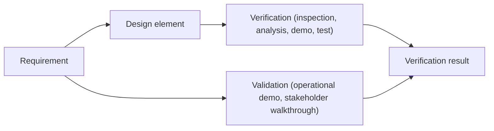

# Verification, Validation & Traceability

## Learning outcomes

- Distinguish **verification** and **validation**  
- Build a small **RTM**  
- Choose a verification method per requirement  

## Verify vs validate

### Table 1 – Verification vs. Validation

|               | Verification                              | Validation                                   |
|---------------|-------------------------------------------|--------------------------------------------|
| **Question** | Did we build it **right**?                | Did we build the **right thing**?         |
| **Against**   | Requirements & design                     | Operational need / stakeholders            |
| **Example**  | Unit test rejects double check‑in         | Manager dry‑run of quarterly export matches contract expectations |

Both are required. Perfect unit tests on the wrong product still fail validation.

### Verification methods (classic)

- **Inspection** – review documents, diagrams, and code artifacts.  
- **Analysis** – apply models, calculations, or static analysis.  
- **Demo** – show the system running in a realistic environment.  
- **Test** – execute controlled inputs and verify expected outputs (unit, integration, system tests).  

*Pick the cheapest method that still provides the needed confidence level.*  

### Traceability matrix (minimum columns)

| Req ID | Description                | Design element                | Verification method | Status* |
|--------|----------------------------|------------------------------|----------------------|---------|
| FR‑CI‑02 | No double check‑in        | `time_state.can_check_in`    | Test                 | Planned |
| FR‑BEOD‑01 | Apply BEOD credit logic | `time_calc.update_daily_summary` | Test (unit)          | Planned |
| NFR‑SEC‑01 | Store PINs as SHA‑256    | `auth.encrypt_pin`           | Inspection (code review) | Planned |

*Status values: **Planned**, **In‑Progress**, **Completed**, **Failed**. Update throughout the project.*
|

Rules of thumb:

- Every FR has ≥ 1 verification method  
- Critical safety/money FRs need stronger evidence  
- **Orphan design** (design element not linked to any FR) → may indicate unnecessary or gold‑plated work.  
- **Orphan FR** (FR without a design element) → likely not implemented; create a design or remove the requirement.
 

### Validation activities (examples)

- **Stakeholder walkthrough** of the Excel package – verifies that the exported data meets operational expectations.  
- **Timed usability test** of quick check‑in – confirms the system is fast enough for real‑world use.  
- **Ops SME review** of mission‑card language – checks that the system’s terminology aligns with mission planning needs.

## Assignment A4

Produce a **Traceability Matrix (RTM)** that includes **all functional requirements** from Assignment A2 (with IDs, design elements, verification method, and status).  
Also submit a **short V&V plan** (≈ ½ page) that outlines which verification methods you will use for each requirement and at least one validation activity for the overall system.

## Selection signal

Candidates who **cannot** say how they would prove a requirement rarely pass selection. Practice saying: “We would test it by…”

> **Reminder:** If any text in the RTM or V&V plan is generated with an AI tool, add an in‑text citation (e.g., *Generated with ChatGPT, 2026*). The underlying logic must be yours.

## Next

**Case‑study walkthrough** – you will see the living ETAS system in action, then move to **military ops modules** that map those activities to operational concepts.

