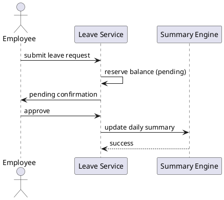

# Case Study — SDC Time Tracker (ETAS)

## Purpose
Connect classroom SE to a **running system** used for FOSC‑related timekeeping.

## Learning outcomes reinforced
- Traceability from **vision → need → requirement → design → verification → validation** (Lessons 1‑7).  
- Practice **stakeholder identification**, **requirement analysis**, **state‑machine** and **sequence** modeling, and **interface control**.  
- Demonstrate **professionalism** (A6) through a reflection exercise.

## Before class
1. Open the time‑tracker app (instructor provides URL; default local `http://localhost:8888`).  
2. Navigate to **Systems Engineering** (`/systems-engineering`).  
3. (Optional) Log a check‑in / leave flow on a demo account to familiarize yourself with the UI.

## Walkthrough agenda (≈ 2 hours)

### 1. Need & stakeholders (15 min)
- Read the operational need on the SE page.  
- **Prompt:** “If you joined CISS as a *tool‑support engineer* or an *ops analyst*, write down the role and one key concern for that role.”  

### 2. Requirements & ACs (25 min)
- Locate `FR‑BEOD‑01` and `AC‑BEOD‑01`.  
- **Group discussion:**  
  1. Why is the **6.0 h minimum** a *requirement* rather than a simple implementation detail?  
  2. How would you test the boundary **5.99 h vs 6.0 h**?  
  3. *What‑if* the rule changed to **5.5 h** – which downstream artifacts would need updating?  

### 3. State machine (20 min)
- Open the punch‑state diagram.  
- **Role‑play illegal actions:**  
  1. **Checkout without check‑in**  
  2. **Double check‑in**  
- Use a shared whiteboard (or virtual sticky notes) to record the transition and system response.

### 4. Sequence — leave approval (20 min)
- Trace the flow: *request → pending reserve → approve → daily‑summary leave hours = target*.  
- **Optional PlantUML snippet** (copy to generate later):  

### 5. Interface — FOSC export (25 min)

- Review the FOSC export interface.
- Discuss TEMPO shortfalls: why hours above TEMPO are zeroed for the discrepancy tracker.
- Prompt: “Identify the exact data element that is zeroed and map it to the supporting FR.”

### 6. Reflection (15 min)

- Each intern writes 5 bullet points answering: “What SE practice would I steal for a radar SA project?”
- Submit the bullets to the A6 Professionalism notes (or hand a printed sheet to the instructor).

## Deliverable (in-class)

- 5‑bullet reflection (submitted under A6).

## Instructor notes

- Demo first, slides second. If the network drops, fall back to the prepared screenshots in the ‘ETAS‑screenshots’ folder.
- Score engagement under the A6 Professionalism rubric.

> **Reminder:** If any text in the RTM or V&V plan is generated with an AI tool, add an in‑text citation (e.g., *Generated with ChatGPT, 2026*). The underlying logic must be yours.

## Next
**Case‑study walkthrough** of the living ETAS system (Lesson 9)
