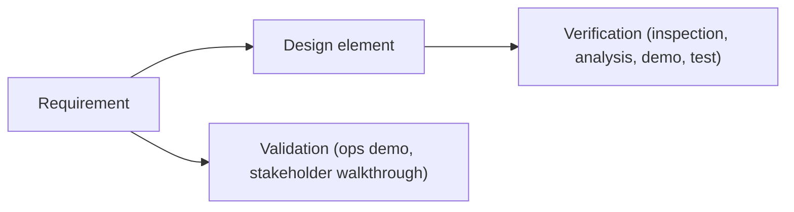

# Verification, Validation & Traceability

## Learning outcomes

- Distinguish **verification** and **validation**  
- Build a small **RTM**  
- Choose a verification method per requirement  

## Verify vs validate

### Table 1 — Verification vs validation

| | Verification | Validation |
|-|--------------|------------|
| **Question** | Did we build it **right**? | Did we build the **right thing**? |
| **Against** | Requirements & design | Operational need / stakeholders |
| **Example** | Unit test rejects double check-in | Manager dry-run of quarterly export matches contract expectations |

Both are required. Perfect unit tests on the wrong product still fail validation.

**Verification is against the requirement text** (the shall), not against a private reading of a test script. Acceptance criteria and tests are **how** you check the FR; they do not rewrite contractual meaning. If a test and an FR disagree, fix the baseline under change control — do not treat the AC as the “real” requirement.

*Alt text: Requirement links to design then verification; requirement also links to validation against operational need.*

### Verification methods (classic)

- **Inspection** — review documents, diagrams, and code artifacts  
- **Analysis** — models, calculations, or static analysis  
- **Demo** — show the system running in a realistic environment  
- **Test** — controlled inputs and expected outputs (unit, integration, system)  

*Pick the cheapest method that still provides the needed confidence level.*

## Traceability matrix (minimum columns)

| Req ID | Description | Design element | Verification method | Status* |
|--------|-------------|----------------|---------------------|---------|
| FR-CI-02 | No double check-in | `time_state.can_check_in` | Test | Planned |
| FR-BEOD-01 | Apply BEOD credit logic | `time_calc.update_daily_summary` | Test (unit) | Planned |
| NFR-SEC-01 | Store PINs as one-way hashes | `auth.encrypt_pin` | Inspection (code review) | Planned |

\*Status values: **Planned**, **In progress**, **Completed**, **Failed**. Update throughout the project.

### Rules of thumb

- Every FR has ≥ 1 verification method  
- Critical safety/money FRs need stronger evidence  
- Every FR should still walk the chain: vision ← **derives_from** need ← **traces_to** use case ← **allocated_to** FR ← **allocated_to** design  
- **Orphan design** (nothing **allocated_to** it from an FR) → may indicate gold plating  
- **Orphan FR** (FR with no design **allocated_to**) → likely not implemented; create a design or remove the requirement  

## Validation activities (examples)

- **Stakeholder walkthrough** of the Excel package — checks operational expectations (validation)  
- **Timed usability test** of quick check-in — confirms speed for real use  
- **Ops SME review** of mission-card language — terminology aligns with mission planning  

## Assignment A4

**Traceability & V&V Plan** — Thursday take-home for this module (**10%**).

Assigned Monday. Due Thursday. Bring a draft RTM (≥ 4 rows) if you want coaching.

Produce a **traceability matrix (RTM)** that includes **all functional requirements** from Assignment A2 (IDs, design elements, verification method, and status), plus a short V&V plan.

See **Assignments** for the full brief and rubric.

## Selection signal

Candidates who **cannot** say how they would prove a requirement rarely pass selection. Practice saying: “We would test it by…”

> **Reminder:** If any text in the RTM or V&V plan is generated with an AI tool, add an in-text citation (e.g., *Generated with ChatGPT, 2026*). The underlying logic must be yours.

## Tools for these artifacts

**Goal:** an RTM a tester can use Monday morning — Excel is enough.

| Artifact | Simplest clear tools | Program / enterprise class |
|----------|----------------------|----------------------------|
| RTM | **Excel / Sheets** (filterable columns) | DOORS / Jama / Polarion trace views |
| V&V plan | Markdown / Word (~½ page) | Test management tools (Jira/Xray, Azure Test Plans, …) |
| Evidence links | Paths, test IDs, ticket keys | CM + CI reports |

Optional: Python/bash only if it *reduces* errors when building a large RTM — never required for A4.

| Topic | Link |
|-------|------|
| Verification (SEBoK) | [System Verification](https://sebokwiki.org/wiki/System_Verification) |
| Validation (SEBoK) | [System Validation](https://sebokwiki.org/wiki/System_Validation) |
| Traceability | [Requirements Management](https://sebokwiki.org/wiki/Requirements_Management) |
| NASA V&V chapters | [NASA SE Handbook](https://www.nasa.gov/reference/systems-engineering-handbook/) |

## Further reading

| Topic | Source |
|-------|--------|
| Verification | [SEBoK — System Verification](https://sebokwiki.org/wiki/System_Verification) · [Verification (glossary)](https://sebokwiki.org/wiki/Verification_(glossary)) |
| Validation | [SEBoK — System Validation](https://sebokwiki.org/wiki/System_Validation) · [Validation (glossary)](https://sebokwiki.org/wiki/Validation_(glossary)) |
| Traceability | [SEBoK — Requirements Management](https://sebokwiki.org/wiki/Requirements_Management) (includes bidirectional traceability) |
| V&V in NASA practice | [NASA Systems Engineering Handbook](https://www.nasa.gov/reference/systems-engineering-handbook/) — verification & validation chapters |
| Test & evaluation framing (US DoD educational) | [DAU](https://www.dau.edu/) — search “Test and Evaluation” guides |
| Requirements → test | [SEBoK — System Requirements Definition](https://sebokwiki.org/wiki/System_Requirements_Definition) |

## Next

**Military ops weeks** (UAE context → CONOPS/AOC → ATO), then **Case Study — SDC Time Tracker (ETAS)** — walk the living system, then **Capstone Preview** (SE-A10). Follow the **Schedule**.
