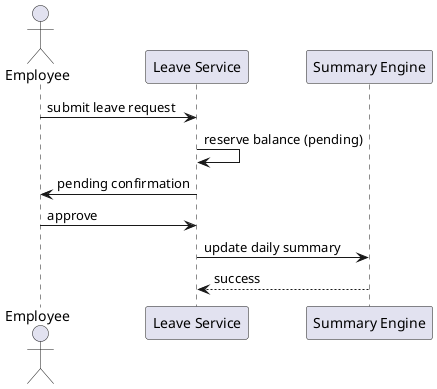

# Case Study — SDC Time Tracker (ETAS)

## Purpose

Connect classroom SE to a **running system** used for FOSC-related timekeeping — electronic check-in/out, leave, BEOD credit, and TEMPO-aware FOSC export packages.

## Learning outcomes reinforced

The activities below reinforce the SE track through Interfaces & V&V:

- Traceability from **vision → need → use case → requirement → design → verification → validation**  
- Practice **stakeholder identification**, **requirement analysis**, **state-machine** and **sequence** modeling, and **interface control**  
- Demonstrate **professionalism (A6)** through a short reflection exercise  

## Before class

1. Open the time-tracker app (instructor provides URL; default local `http://localhost:8888`).  
2. Navigate to **Systems Engineering** (`/systems-engineering`).  
3. (Optional) Log a check-in / leave flow on a demo account to familiarize yourself with the UI.  

## Walkthrough agenda (~2 hours)

### 1. Need & stakeholders (15 min)

- Read the operational need on the SE page.  
- **Prompt:** “If you joined CISS as a *tool-support engineer* or an *ops analyst*, write down the role and one key concern for that role.”  

### 2. Requirements & ACs (25 min)

- Locate `FR-BEOD-01` and `AC-BEOD-01`.  
- **Group discussion:**  
  1. Why is the **6.0 h minimum** a *requirement* rather than a simple implementation detail?  
  2. How would you test the boundary **5.99 h vs 6.0 h**?  
  3. *What-if* the rule changed to **5.5 h** — which downstream artifacts (design, test, export) would need updating?  
  4. Does the AC only **prove** the FR, or does it sneak in meaning the FR does not state? (If the FR were vague, which would a customer enforce?)  

### 3. State machine (20 min)

- Open the punch-state diagram.  
- **Role-play illegal actions** (whiteboard or sticky notes):  
  1. Volunteer plays **Employee**.  
  2. Instructor (or peer) plays **System** and announces the response.  
  3. Group records the transition and reject path.  
- Scenarios: **checkout without check-in**, **double check-in**.  

### 4. Sequence — leave approval (20 min)

- Trace the flow: *request → pending reserve → approve → daily-summary leave hours = target*.  
- Optional PlantUML (copy to generate later):  

### 5. Interface — FOSC export (25 min)

- Review the FOSC export interface.  
- Discuss TEMPO shortfalls: why hours above TEMPO are zeroed for the discrepancy tracker.  
- **Prompt:** “Identify the exact data element that is zeroed and map it to the supporting FR.”  

### 6. Reflection (15 min)

- Each intern writes **5 bullet points** answering: “What SE practice would I steal for a radar SA project?”  
- Submit to the **A6 Professionalism** notes (or hand a printed sheet to the instructor).  

**What strong reflections show:** relevance to a future SA system, specificity (not slogans), SE terminology, and a link to a concrete artifact you just saw (FR, state, sequence, or ICD).

## Deliverable (in-class)

- 5-bullet reflection (submitted under **A6**).

## Instructor notes

- Demo first, slides second. If the network drops, fall back to prepared screenshots in the course `ETAS-screenshots` folder (or course drive).  
- Score engagement under the **A6 Professionalism** rubric (participation, depth of analysis, clarity of reflection, timeliness).  

> **Reminder:** If any wording is generated with an AI tool, add an in-text citation (e.g., *Generated with ChatGPT, 2026*). The underlying analysis must be yours.

## Further reading

| Topic | Source |
|-------|--------|
| Case study learning | [SEBoK — Case Studies](https://sebokwiki.org/wiki/Case_Studies) (if available in current SEBoK; else search SEBoK “examples”) |
| Living documentation / continuous SE | [SEBoK — Model-Based Systems Engineering](https://sebokwiki.org/wiki/Model-Based_Systems_Engineering) (direction of travel; this course stays lightweight) |
| Walk the cascade again | Course modules: vision → needs → use cases → EARS → architecture → behavior → ICD → RTM |
| Related SE practice | [INCOSE](https://www.incose.org/) webinars / student resources |
| Professional reflection | Your A6 bullets should cite **which artifact** (FR, state, ICD) you would steal for radar SA |

## Next

**Ops track** (schedule may place this after or before case study): start with **UAE Military Context**, then **CONOPS & AOC** — map SE habits onto air operations concepts used on the program.
