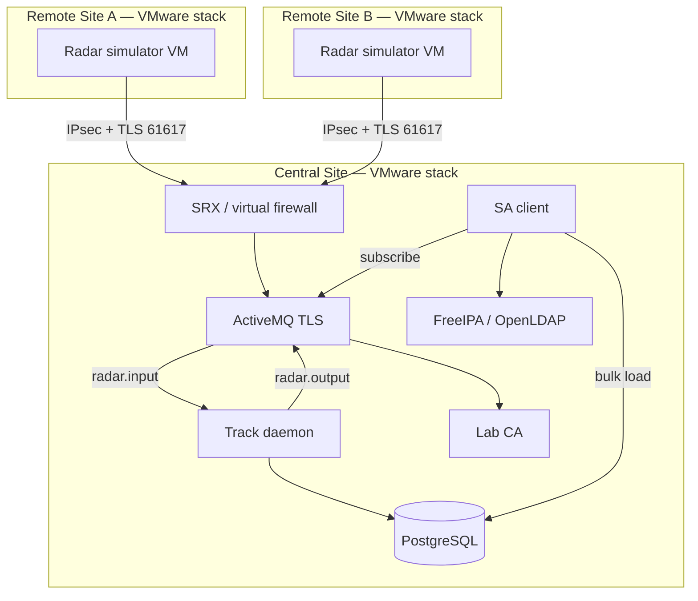

# PRSAS Implementation — Shared Kickoff

> **Phase:** main-project implementation (after SE-A10 framing).  
> **Document:** [UC-CISS_PROJECT-001](/content/project/radar_sa_project.md) in the course repo.  
> **Audience:** every track. Read this before your discipline modules.  
> **Classification:** unclassified lab only.

## Learning outcomes

After this module you can:

- Restate **UC-CISS_PROJECT-001** (fused air picture from two simulated radars) in one minute  
- Name the **three VMware stacks** and what each track owns  
- Point to the **shared contracts** (topics, teaching payload, addressing, ports)  
- Keep **VM-first** lab discipline (containers are a later PoC, not the default runtime)  
- Apply the same **integrity rules** as the SA framing week  

## What we are building

**PRSAS** — Prototype Radar Situational Awareness System.

| Item | Value |
|------|--------|
| Use case | **UC-CISS_PROJECT-001** — Display a real-time air picture from simulated radar sources |
| Feeds | Two remote **ASTERIX-like Cat 062** simulators (Mode 3/A present) |
| Transport | TLS-secured JMS/STOMP into Central **ActiveMQ** (`radar.input`) |
| Processing | Track daemon correlates on **Mode 3/A**, persists to **PostgreSQL**, publishes `radar.output` |
| Display | Authenticated client: bulk load from Postgres, then live updates from the output topic |
| Protection | Site-to-site **IPsec** + host firewalls + lab CA + FreeIPA/OpenLDAP |

This is **not** a live air-defense C2. It is a classroom system that practices the same *shape* as a distributed surveillance picture.



**Postcondition of the use case:** a secure, reliable path from distributed simulators to a consistent multi-client picture with an audit trail in Postgres.

## How this pack relates to SE-A10

| Already done (SE-A10) | This pack |
|----------------------|-----------|
| Vision, needs, UCs, EARS starter | Expand into a **CONOPS** and allocated architecture |
| Dual-feed conflict as IF/THEN | Implement correlation, coast, drop, conflict |
| Six-field feed table | Versioned **teaching ICD** on ActiveMQ |
| Mini RTM | Integration tests + lessons-learned |

Do **not** throw away your framing pack. SE expands it. Other tracks implement against it.

## Sister project (out of scope)

The same project file also contains **LLAP** (Local LLM Assistant Platform, UC-CISS_PROJECT-002). That is a **separate** intern project. Do not mix GPU/MCP tasks into PRSAS tickets unless the instructor opens LLAP.

## Role map (who builds what)

| Track | Owns | Does not own |
|-------|------|----------------|
| **SE** | CONOPS, MBSE (sequence / hybrid state / logical components), track schema, virt-vs-VM study, lessons-learned | Shipping production Java or Junos commits |
| **SW** | Simulator, track daemon, SA client, Docker/K8s *PoC* of two components | Live AD sensors; inventing the schema without SE |
| **NET** | Three-site topology, EX/SRX, IPsec, allow-list, evidence pack, config guide | App code; CA private keys in tickets |
| **ADMIN** | VM images, FreeIPA/OpenLDAP, lab CA + certs, SELinux/firewalld/audit, Ansible/PowerCLI | Junos policy as the system of record |
| **MIL** | Operator / supervisor picture literacy; unclassified briefing of what the picture *means* | Network configs or Java |

Integration week is **shared**. No track “finishes” alone.

## Shared lab contracts (freeze these)

Instructor may remap IPs on the lab sheet. If they do, **write the live values** in your notebook and keep these names.

### Sites and addressing (extends the NET fabric)

| Site | Role | Teaching block | VLAN |
|------|------|----------------|------|
| **Remote A** | Simulator A | `10.10.30.0/24` | VLAN 30 |
| **Remote B** | Simulator B | `10.20.30.0/24` | VLAN 30 |
| **Central** | AMQ, daemon, Postgres, auth, CA, clients | `10.30.20.0/24` servers · `10.30.10.0/24` users | VLAN 20 / 10 |
| Mgmt | fxp0 / me0 / VLAN 99 | `10.255.0.0/24` | 99 |
| IPsec A↔Central | `st0` overlay | `10.255.101.0/30` | — |
| IPsec B↔Central | `st0` overlay | `10.255.102.0/30` | — |

Reuse Site-A / Site-B user VLANs from the NET track (`10.10.10.0/24`, `10.20.10.0/24`) for operator stations if the bench already has them.

### Hostnames (teaching)

| Hostname | Site | Function |
|----------|------|----------|
| `sim-a-01` | Remote A | Cat 062-like publisher |
| `sim-b-01` | Remote B | Cat 062-like publisher |
| `srx-a-fw-01` / `srx-b-fw-01` / `srx-c-fw-01` | Each site | Zone firewall + IPsec |
| `amq-c-01` | Central | ActiveMQ Classic |
| `trk-c-01` | Central | Track daemon |
| `pg-c-01` | Central | PostgreSQL |
| `ipa-c-01` | Central | FreeIPA / OpenLDAP |
| `ca-c-01` | Central | Lab CA (may share IPA) |
| `ui-c-01` | Central | Browser / JavaFX client host |

### Ports and destinations

| Service | Port | Notes |
|---------|------|--------|
| ActiveMQ OpenWire TLS | **61617** | Lab default for PRSAS (clear 61616 is off in the hardened picture) |
| ActiveMQ STOMP TLS | 61614 | Allowed if the instructor enables it |
| ActiveMQ console | 8161 | Mgmt VLAN only |
| PostgreSQL | 5432 | Central server VLAN; daemon + read-only client role |
| HTTPS client / REST proxy | 443 | If SW adds a thin API |
| FreeIPA | 80/443, 389/636, 88 | Admin module |
| IKE / ESP | UDP 500, UDP 4500, ESP | NET module |

**Topics**

| Destination | Kind | Producer | Consumer |
|-------------|------|----------|----------|
| `radar.input` | Topic | `sim-a-01`, `sim-b-01` | `trk-c-01` |
| `radar.output` | Topic | `trk-c-01` | SA clients |

### Teaching payload (ASTERIX-*like*, not official binary)

Official Cat 062 is a binary EUROCONTROL encoding. The **lab contract** is a versioned JSON object that *carries the same ideas*. Label every field **CISS-TEACH**. Do not claim it is edition-certified ASTERIX.

```json
{
  "msg_type": "CAT062_LIKE",
  "edition": "CISS-TEACH-1",
  "sac": 1,
  "sic": 11,
  "source_id": "RSA",
  "track_num": 42,
  "tod": "2026-08-14T08:00:01.000Z",
  "lat_deg": 24.4539,
  "lon_deg": 54.3773,
  "alt_ft": 18000,
  "vx_kt": 120.0,
  "vy_kt": 40.0,
  "mode3a": "4521",
  "callsign": "UAE421"
}
```

| Rule | Why |
|------|-----|
| `mode3a` is four octal digits as a string | Primary **correlation key** |
| `sic` differs per remote site | You can tell which feed spoke |
| `tod` is ISO-8601 UTC | No silent local-time |
| Units in the field name | Mars Climate Orbiter lesson from SE-07 |
| Unknown fields → log and keep going | Do not drop the track for one optional item |

Output topic may publish a **system track** object (fused) plus `state` (`INIT` / `LIVE` / `COAST` / `CONFLICT` / `DROP`) and `sources[]`.

## Runtime rule

**VMs are the system of record.** Postgres, ActiveMQ, IPA, simulators, and the daemon run as guests (or services on guests) under vSphere/ESXi.

Docker / minikube appears only in **SE-15** and **SW-12** as a *comparison PoC* for two components. Do not surprise ADMIN by “I containerized prod.”

## Integrity (non-negotiable)

| Allowed | Not allowed |
|---------|-------------|
| Invented tracks, teaching lat/lon (e.g. near Abu Dhabi FIR for flavour) | Real tracks, real sites, real ATO / unit tasking |
| Public ASTERIX *style* + CISS-TEACH JSON | Controlled program ICDs or screenshots |
| Lab PSKs / PINs from the instructor sheet | Pasting private keys, live PSKs, or production hashes |
| Human-in-the-loop on conflict disposition | Auto-engage / auto-prosecute |
| Cite AI for wording or boilerplate | Submit a generated CONOPS or daemon you cannot explain |

If you are unsure a fact is open-source, **leave it out**.

## Monday workshop (all tracks)

Work in mixed-discipline tables of 4 if the room allows (SE + SW + NET + ADMIN). MIL joins the SE table.

1. **15 min** — Restate the use case and postcondition. One scribe per table.  
2. **20 min** — Draw the three-site picture on paper using **course hostnames**. Mark who owns each box.  
3. **20 min** — Freeze the teaching payload: copy the JSON, add one field your table thinks is missing, justify units.  
4. **15 min** — List **five integration risks** (example: IPsec up but TLS name mismatch). Assign an owner track to each.  
5. Peer swap: can another table brief *your* picture in 60 seconds?

## Thursday assignment

**SE-A12 — PRSAS Interface & Ownership Map** (SE track, required).  
Other tracks: start your first PRSAS module worksheet; SE-A12 is the shared contract you will implement against.

## Tools for these artifacts

| Artifact | Simplest clear tool |
|----------|---------------------|
| Ownership / port / topic tables | Markdown |
| Three-site picture | Mermaid |
| Payload edition | JSON in a fenced block + field table |
| Risks | Five-row table with owner track |

## Further reading

| Topic | Source |
|-------|--------|
| Project statement | `content/project/radar_sa_project.md` |
| Framing pack | **se-10** + your SE-A10 |
| Messaging ICD habits | **se-07 Interfaces** · public [EUROCONTROL CAT062](https://www.eurocontrol.int/publication/cat062-eurocontrol-specification-surveillance-data-exchange-asterix-part-9-category-062) |
| Lab fabric names | **net-00** addressing plan |
| VM-first runtime | Course README · **admin-07** |

## Next

| Track | Next module |
|-------|-------------|
| SE | **PRSAS CONOPS** |
| SW | **Radar message simulator** |
| NET | **Three-site topology** |
| ADMIN | **VM provision** |
| MIL | **Air picture for operators** |
