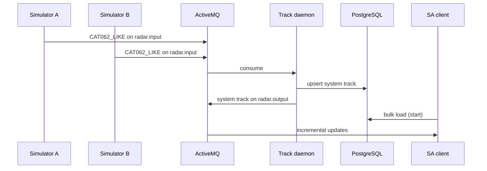

# PRSAS CONOPS

> **Phase:** implementation. Expands SE-A10 into an operational concept the other tracks can build against.  
> **Use case:** UC-CISS_PROJECT-001.

## Learning outcomes

After this module you can:

- Write a **concise CONOPS** (context, users, mission thread, what “good” looks like)  
- Name **stakeholders** and separate operator vs supervisor vs maintainer  
- Describe the **data flow** from simulator to picture without jumping to class names  
- State **in / out of scope** so SW/NET/ADMIN do not invent a second system  
- Keep the picture **unclassified** and human-in-the-loop  

## What a CONOPS is (here)

A Concept of Operations is **how people will use the system in context** — not a design document and not a slide theme.

| CONOPS answers | CONOPS does not |
|----------------|-----------------|
| Who operates it, where, why | Maven package layout |
| What a successful 10-minute watch looks like | Junos `set` lines |
| What happens when a feed dies | “The UI shall be intuitive” |
| What is deliberately out of scope | Live weapon employment |

SE-11 literacy: this is the closest course product to an **OV-1 / OV-5-style** story. You may *map* it; you do not need Cameo.

## Operational context (teaching)

Two remote lab radars (Site A, Site B) publish system-track-like updates into a central picture. A **watch operator** monitors the fused picture. A **supervisor** handles dual-feed conflicts and stale tracks. Maintainers keep VMs, tunnels, and certs up. Nobody in this lab prosecutes a track.

```text
Detect (simulators) → Exchange (IPsec + TLS + AMQ) → Correlate (daemon)
        → Persist (Postgres) → Display (client) → Decide (human)
```

Tie vocabulary to **ops-00** (picture, track, alert) without copying any controlled CONOPS.

## Stakeholders (minimum set)

| Stakeholder | Need (course grammar seed) |
|-------------|----------------------------|
| Lab watch operator | As operator, we need one picture with source and time on every track, so that we do not brief a silent stale plot |
| Supervisor | As supervisor, we need dual-feed disagreements raised, not auto-resolved, so that we can dispose the conflict |
| SW intern | As developer, we need a frozen payload edition, so that A and B sims do not drift |
| NET intern | As network engineer, we need an allow-list of ports, so that the SRX is not “permit any” |
| ADMIN intern | As administrator, we need named service accounts and certs, so that daemons are not run as root with ad-hoc keys |
| Instructor / acquirer | As acquirer, we need evidence the use-case postcondition is met, so that we can select for the main project |

## Scope

**In**

- Two simulated Cat 062-*like* feeds  
- Mode 3/A correlation with a position/velocity **gate** fallback  
- Coast / drop / conflict states  
- Authenticated client, bulk load + live topic  
- Three-site VM path with IPsec + TLS  

**Out**

- Live sensors, IFF crypto, Link-16, real ATO  
- Auto-engage, weapons pairing, identification friend/foe adjudication  
- Official ASTERIX binary certification  
- LLAP / GPU inference  
- Multi-region WAN beyond the lab VLAN/IPsec story  

**Assumption:** feeds are lab simulators. Positions may be geographically flavoured (UAE FIR) but are **fiction**.

## Mission thread (happy path)

1. Operator logs in with lab credential / client cert.  
2. Client loads current system tracks from Postgres (empty is legal at T=0).  
3. Instructor starts sim-A and sim-B scenarios.  
4. Daemon initiates tracks on first Mode 3/A, updates on subsequent plots.  
5. Operator sees two (or more) symbols with Mode 3/A, velocity vector, and source.  
6. Supervisor is idle unless a rule fires.

## Unwanted threads (must be in the CONOPS)

| Thread | Operator-visible behaviour | System shall not |
|--------|----------------------------|------------------|
| Dual-feed same Mode 3/A, positions agree | One fused track, `sources = [A,B]` | Invent a third ID |
| Dual-feed same Mode 3/A, positions disagree beyond gate | **CONFLICT** alert, both hypotheses visible | Silently pick A |
| Feed A stops | Track **COAST** then **DROP** per timers | Freeze the last plot forever with no flag |
| Broker bounce | Client reconnects; daemon does not lose persisted tracks | Require a human to truncate the DB |
| Bad cert / expired | Login fails closed | Fall back to anonymous map |

These threads become sequence diagrams in **se-14** and test cases in **se-15**.

## Data flow (logical — not deployment)



Deployment (which VM, which VLAN) is **se-05 habit + NET/ADMIN**. Keep this module on *who/why/what flow*.

## Monday workshop (builds SE-A13)

1. **15 min** — Rewrite the vision from SE-A10 in two sentences that a network intern will accept.  
2. **20 min** — Stakeholder table (≥ 6) with one need each in course grammar.  
3. **20 min** — Happy-path thread (8–12 steps) + three unwanted threads.  
4. **15 min** — In/out/assumptions. Peer must find one gold-plated “in” to throw out.  
5. Sketch the sequence above from memory — then check this page.

## Thursday assignment

**SE-A13 — PRSAS CONOPS.** Assigned this Monday. Due this Thursday.

## Tools for these artifacts

| Artifact | Simplest clear tool |
|----------|---------------------|
| CONOPS body | Markdown (4–6 pages, not 40) |
| Stakeholders / needs | Table |
| Mission thread | Numbered list + Mermaid sequence |
| Scope | Three bullet lists |

## Further reading

| Topic | Source |
|-------|--------|
| What a CONOPS is | [SEBoK — Concept of Operations](https://sebokwiki.org/) |
| Ops vocabulary | **ops-00 CONOPS & AOC** (unclassified) |
| SA theory | Endsley — search author + “situation awareness” |
| Your seed | SE-A10 pack |

## Next

**PRSAS MBSE & track schema** — sequence, hybrid track lifecycle, logical components, and the Postgres model.
