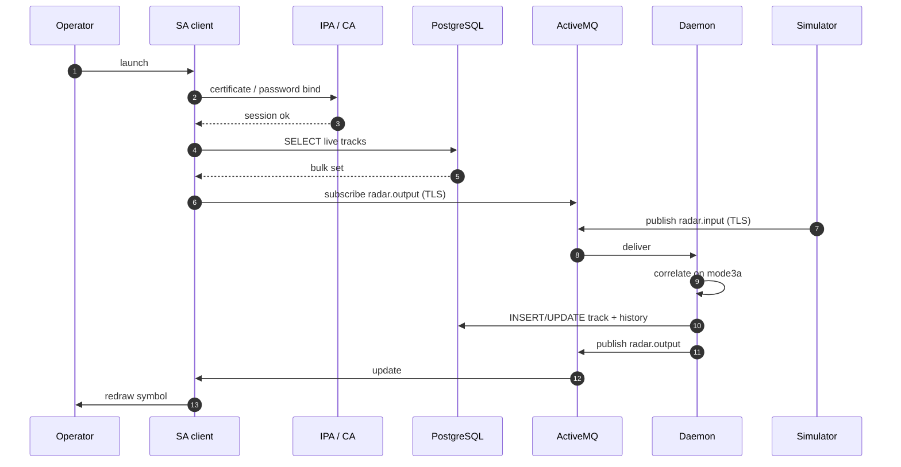
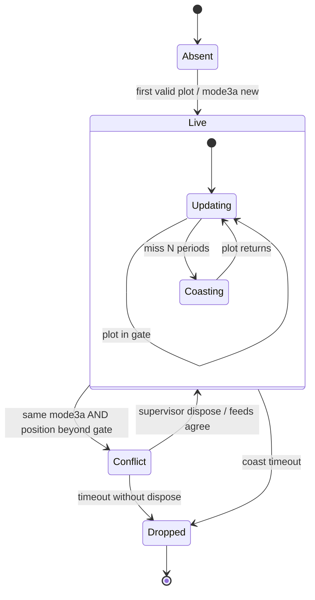
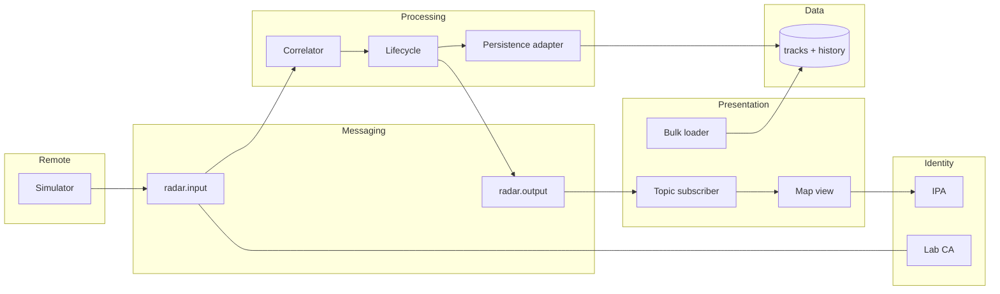

# PRSAS MBSE Artifacts & Track Schema

> **Phase:** implementation. These artifacts *are* the design baseline SW and ADMIN implement.

## Learning outcomes

After this module you can:

- Draw a **sequence** for ingest → correlate → persist → publish → display  
- Draw a **hybrid state machine** for the system-track lifecycle (including CONFLICT)  
- Draw a **logical component** view (sim, topics, daemon, DB, client, auth)  
- Specify a **PostgreSQL track schema** with Mode 3/A as the correlation key  
- Allocate EARS from SE-A10 / SE-A13 onto components  

## Why “MBSE” here

You are not opening Rhapsody. You are producing the **same information** a model would hold, in reviewable markdown + Mermaid (SE-11 literacy).

| Artifact | Question it answers |
|----------|---------------------|
| Sequence | What is the *order* of messages for UC-CISS_PROJECT-001? |
| Hybrid state | What are legal *track* states and what *triggers* them? |
| Logical component | What pieces exist, and which FR is **allocated_to** which piece? |
| Schema | What is persisted, keyed, and auditable? |

If sequence, state, and schema disagree, **stop coding**.

## Sequence (teaching baseline)

Expand this. Show TLS/auth as messages, not magic.



Add an **alt** fragment for CONFLICT and for coast timeout in your assignment.

## Hybrid state — system track

“Hybrid” here means: a **composite** LIVE region (updating vs coasting) plus a sibling CONFLICT, not a flat soup of statuses.



| Trigger | Guard | Activity |
|---------|-------|----------|
| `plot_rx` | new `mode3a` | create track; `INIT` history row |
| `plot_rx` | same `mode3a` and inside gate | update kin; reset miss counter |
| `plot_rx` | same `mode3a` and beyond gate | raise CONFLICT; keep both hypotheses |
| `tick` | misses ≥ `N` | enter Coasting |
| `tick` | coast ≥ `T` | DROP; persist end reason |
| `supervisor_ack` | in Conflict | record disposition; return to Live if resolved |

**N** and **T** are requirements (example: N = 3 missed 1 Hz periods; T = 30 s). Put numbers in the CONOPS/NFR, not only in code.

Status vs state (se-06): `mode3a`, `callsign`, `lat` are **status**. `Live.Coasting` is **state**.

## Logical components



### Allocation sketch

| FR idea (from framing) | allocated_to |
|------------------------|--------------|
| WHEN a plot arrives, display with source, time, units | Simulator fields + Map view |
| IF two feeds disagree beyond gate, raise conflict, do not silent-pick | Correlator + Lifecycle + Map |
| WHILE a track is Live, persist history | Persistence adapter |
| Client authenticates before picture | IPA + Client |

## PostgreSQL schema (teaching baseline)

Mode 3/A is the **correlation key**, not necessarily the only unique key (two historical tracks can reuse a squawk). Use a surrogate `track_id` for the system track; store `mode3a` indexed.

```sql
-- CISS-TEACH-1 — not a classified schema
CREATE TABLE system_track (
  track_id        BIGSERIAL PRIMARY KEY,
  mode3a          CHAR(4) NOT NULL,
  callsign        TEXT,
  state           TEXT NOT NULL,          -- INIT/LIVE/COAST/CONFLICT/DROP
  lat_deg         DOUBLE PRECISION,
  lon_deg         DOUBLE PRECISION,
  alt_ft          INTEGER,
  vx_kt           DOUBLE PRECISION,
  vy_kt           DOUBLE PRECISION,
  sources         TEXT[] NOT NULL,        -- e.g. {RSA,RSB}
  last_tod        TIMESTAMPTZ NOT NULL,
  last_sic        INTEGER,
  miss_count      INTEGER NOT NULL DEFAULT 0,
  created_at      TIMESTAMPTZ NOT NULL DEFAULT now(),
  dropped_at      TIMESTAMPTZ,
  drop_reason     TEXT
);

CREATE INDEX idx_system_track_mode3a ON system_track (mode3a);
CREATE INDEX idx_system_track_state  ON system_track (state);

CREATE TABLE track_history (
  hist_id     BIGSERIAL PRIMARY KEY,
  track_id    BIGINT NOT NULL REFERENCES system_track(track_id),
  tod         TIMESTAMPTZ NOT NULL,
  lat_deg     DOUBLE PRECISION,
  lon_deg     DOUBLE PRECISION,
  alt_ft      INTEGER,
  state       TEXT NOT NULL,
  sic         INTEGER,
  source_id   TEXT,
  raw_json    JSONB
);
```

| Rule | Why |
|------|-----|
| `mode3a CHAR(4)` | Teaching squawks are four octal digits |
| `sources TEXT[]` | Dual-feed visibility |
| `raw_json` on history | Audit; replay a CONFLICT |
| No secret columns | Auth is IPA, not a password in the track table |
| Daemon role: INSERT/UPDATE; client role: SELECT | Least privilege (ADMIN-08) |

Fallback correlation (no Mode 3/A or spoof suspicion): **position/velocity gate** documented as an NFR (example: 1 NM and 50 kt). Write the formula in the assignment; do not hide it in code comments only.

## Monday workshop (builds SE-A14)

1. **20 min** — Sequence with one `alt` (CONFLICT or broker down).  
2. **20 min** — Hybrid state: copy the baseline, add one guard you can test.  
3. **20 min** — Component diagram + allocation table (≥ 6 FRs).  
4. **20 min** — Schema: start from the SQL above; add **one** justified column (or refuse a bad one).  
5. Peer check: can SW implement the daemon from *only* your pack?

## Thursday assignment

**SE-A14 — MBSE pack + schema.** Due this Thursday.

## Tools for these artifacts

| Artifact | Simplest clear tool |
|----------|---------------------|
| Sequence / state / components | Mermaid |
| Allocation / schema notes | Tables |
| DDL | `schema.sql` in the write-up |

## Further reading

| Topic | Source |
|-------|--------|
| State vs status | **se-06** |
| Allocation | **se-05** |
| UML vs SysML | **se-11** |
| JDBC / roles | **sw-04**, **admin-08** |
| ASTERIX Cat 062 pointer | public EUROCONTROL CAT062 page |

## Next

**Virtualization study & lessons-learned** — measure VM vs container for two components; close the pack with evidence.
