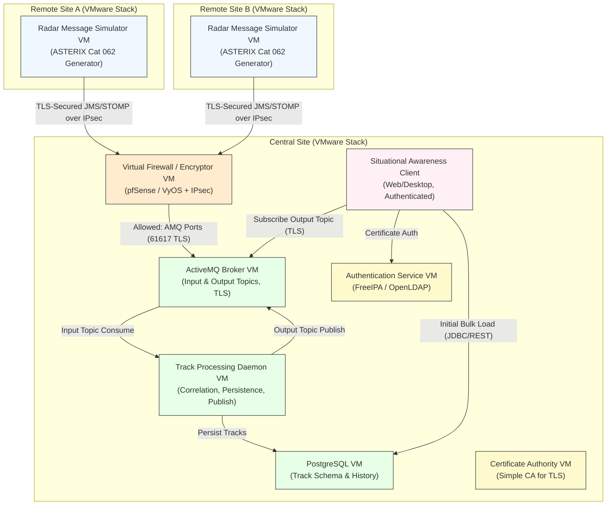

# Document Export

**Date**: 8/14/2026

---

## CISS-GEN-DOC-001: CISS Project

**Status**: Draft | **Type**: text

# **Use Case: UC-CISS_PROJECT-001**
 ## Display Real-Time Air Picture from Simulated Radar Sources

**Preconditions**
- Three VMware hardware stacks deployed and networked:
  - Remote Site A: Radar message simulator VM
  - Remote Site B: Radar message simulator VM
  - Central Site: ActiveMQ broker, track processing daemon, PostgreSQL, situational awareness client(s)
- Firewalls and encryptors configured for secure traffic between sites
- VMs provisioned with required OS, authentication, and certificates
- Network paths validated (simulated radar data reaches central ActiveMQ input topic)

**Main Flow**
1. Simulated radars on Remote Site A and Remote Site B publish ASTERIX (Like) Category 062 messages (with Mode 3/A codes) across the secured network to the Central Site's ActiveMQ input topic.
2. Central track processing daemon consumes messages, correlates/manages tracks using Mode 3/A, persists to PostgreSQL, and publishes updated tracks to output topic.
3. Web Client:
   - Authenticates user via certificate/domain credentials
   - Loads full track set from PostgreSQL
   - Subscribes to output topic for real-time updates
   - Renders fused multi-sensor air picture on map display
   - Update Map display based on messages from output topic.

**Postconditions**
- Secure, reliable data flow from distributed radars to central processing and display
- Multi-client consistent air picture with full audit trail

# **Intern Role-Specific Tasks**

**Network Engineer Tasks**
1. Design and document logical network topology (three sites, segregated subnets, firewall rules).
2. Deploy and configure virtual firewall appliances with rule sets allowing only required ports/protocols (ActiveMQ TLS, PostgreSQL, Web Clients).
3. Implement site-to-site encryption (IPsec VPN tunnels) between remote and central stacks.
4. Validate end-to-end connectivity and perform basic security testing (e.g., port scans, traffic capture).
5. Produce a network configuration guide

**System Administrator Tasks**
1. Provision VMware VMs across the three stacks with standardized OS images.
2. Configure centralized authentication (e.g., FreeIPA, OpenLDAP, or Active Directory simulation) and integrate with VMs.
3. Generate, distribute, and install X.509 certificates for ActiveMQ TLS, client authentication, and daemon-to-database connections.
4. Implement host-based security (SELinux policies, firewallD rules, audit logging).
5. Document deployment scripts (e.g., Ansible playbooks or PowerCLI) 

**Systems Engineering**  
1. Develop a concise CONOPS documents describing operational context, stakeholders, and data flow.
2. Produce MBSE artifacts:
   - Detailed sequence diagrams
   - Hybrid state diagram for system track lifecycle
   - Logical component diagram showing daemon, AMQ topics, DB, and client interactions
3. Define and document the PostgreSQL track schema (including Mode 3/A as primary correlation key).
4. Perform study on virtualization/Containerization technologies (e.g., containerize the daemon with Docker and deploy to local Kubernetes/minikube; compare deployment time, resource usage, and scalability vs. VMware VM baseline).
5. Author a final lessons-learned report with quantitative findings and specific migration recommendations.

### Developer Tasks

1. **Radar Message Simulator (Remote Sites)**  
   - Develop a configurable ASTERIX Category 062 like message generator application to deploy on the Remote Site A and Remote Site B VMs.  
   - Support scripted or random scenarios with varying Mode 3/A codes, positions, velocities, and update rates.  
   - Publish messages reliably over the secured network path to the Central Site’s ActiveMQ input topic (using TLS-secured JMS or STOMP client).  
   - Include basic controls for start/stop, scenario selection, and message rate throttling.

2. **Track Processing Daemon (Central Site)**  
   - Implement a lightweight, language-agnostic daemon service that runs as a systemd/process on the Central Site VM.  
   - Consume Cat 062 messages from the ActiveMQ input topic.  
   - Perform track correlation, initiation, coasting, and drop using Mode 3/A as the primary correlation key (with fallback to position/velocity gating).  
   - Persist updated system tracks (including history) to PostgreSQL using a defined schema.  
   - Publish fused track update messages (simplified format or full track objects) to the separate ActiveMQ output topic immediately after processing.  
   - Include error handling, logging, and graceful degradation for network/database interruptions.

3. **Situational Awareness Client (Central Site or Remote Operator Station)**  
   - Build a web client (e.g., Node.js/React with Leaflet/OpenLayers or Electron) that:  
   - Authenticates the user on launch using provided certificates or domain credentials (integrate with the admin-provisioned auth service).  
   - Performs an initial bulk load of all current system tracks from PostgreSQL via direct query or REST proxy.  
   - Subscribes to the ActiveMQ output topic (TLS-secured) for incremental real-time track updates.  
   - Renders a geographic map overlay with track symbols, Mode 3/A labels, velocity vectors, history trails, and basic filtering/zoom controls.  
   - Handles reconnection logic and display refresh efficiently.

4. **Integration and Prototyping**  
   - Collaborate with network engineers and administrators during end-to-end integration testing across the three stacks.  
   - Containerize at least two components (e.g., simulator and daemon) using Docker and demonstrate deployment to a local Kubernetes cluster (minikube or kind) as a tech-refresh proof-of-concept.  
   - Measure and document performance differences (startup time, resource usage, scalability) between VM-native and containerized deployments.  
   - Contribute to the final lessons-learned report with code quality, maintainability observations, and specific migration recommendations.

### Complete Bill of Materials (BOM)

**Assumptions**
- Intern count: 8 (e.g., 3 developers, 2 network engineers, 2 sysadmins, 1 systems engineer; scalable).
- Intern workstations: High-spec laptops (NVIDIA GPU essential for LLAP performance; 16B+ models viable with 16-24GB VRAM).
- Docking + dual monitors: For ergonomic multi-screen coding/config work.
- Client machines: 4 additional lower-spec desktops/laptops for independent web app testing (e.g., multi-user simulation without conflicting with dev environments).
- Pricing: Approximate February 2026 UAE market (Dell/HP/Lenovo via Microless, Amazon.ae, local Abu Dhabi resellers); excludes VAT/shipping—formal quotes advised.

| Category              | Item                                      | Quantity | Description / Rationale                                                                 | Recommended Model / Specs                          | Est. Unit Price (AED) | Est. Total (AED) | Notes / Alternatives |
|-----------------------|-------------------------------------------|----------|-----------------------------------------------------------------------------------------|----------------------------------------------------|-----------------------|------------------|----------------------|
| **Hardware – Servers (PRSAS)** | VMware ESXi Host Server                   | 3        | Dedicated host per stack for distributed simulation                                     | HPE ProLiant DL360 Gen11 or Dell PowerEdge R660 (1x Xeon Silver, 64-128GB RAM, 2x 960GB+ SSD) | 15,000–20,000 | 45,000–60,000 | Refurb: 5,000–8,000/unit. |
| **Hardware – Intern Workstations** | High-Spec Developer Laptop                | 8        | Primary intern machine; GPU for LLAP local inference                                     | Dell XPS 16 or Lenovo ThinkPad P16 (RTX 4070-4090, 32-64GB RAM, 1TB SSD) | 8,000–12,000  | 64,000–96,000  | Budget: RTX 4060 (~6,000 AED). |
| **Hardware – Intern Peripherals** | USB-C Docking Station                     | 8        | Multi-monitor support                                                                   | Dell WD22TB4 or Lenovo Thunderbolt 4               | 800–1,200     | 6,400–9,600     | |
| **Hardware – Intern Peripherals** | 27" QHD Monitor (dual per intern)         | 16       | Dual-screen productivity                                                                | Dell U2723QE or Samsung ViewFinity                 | 1,200–1,800   | 19,200–28,800  | Single monitor to reduce cost. |
| **Hardware – Testing Clients** | Mid-Spec Client Desktop/Laptop            | 4        | Dedicated for web app testing                                                           | Dell OptiPlex or Lenovo ThinkCentre (i7, 32GB RAM) | 3,000–5,000   | 12,000–20,000  | |
| **Hardware – Networking** | Juniper EX2300 Ethernet Switch            | 3        | Managed L3 PoE+ switch per stack; VLANs, QoS, trunking for site simulation              | EX2300-24P (24-port Gigabit PoE+, 4x SFP uplinks)   | 2,000–3,000   | 6,000–9,000     | Junos OS; higher: EX3400-24P (~6,500 AED/unit). |
| **Hardware – Networking** | Juniper SRX300 Services Gateway            | 3        | Firewall/router/encryptor per site; IPsec VPN tunnels, security zones                   | SRX300-SYS-JB/JE (8x GE, Junos Enhanced)           | 1,300–3,600   | 3,900–10,800    | Includes base Junos; licenses may add cost for advanced features (e.g., IPS). |
| **Hardware – Networking** | Cat6 Ethernet Cables (assorted)           | 1 pack   | Physical connections                                                                    | Generic shielded Cat6                              | 200–400       | 200–400         | |
| **Hardware – Rack/Enclosure** | 12-18U Rack Cabinet (optional)            | 1        | Organized housing                                                                       | Generic                                            | 2,000–4,000   | 2,000–4,000     | Optional. |
| **Virtualization**   | VMware ESXi Hypervisor                    | 3 hosts  | Free reinstated edition (2025) for standalone non-production hosts                      | Free ESXi 8.0 Update 3+ (Broadcom portal, registration required) | 0             | 0               | Sufficient for prototype; no vCenter. Alternative: Proxmox VE (unrestricted free, built-in management). |
| **Operating System** | Rocky Linux / Ubuntu LTS (guest VMs)      | N/A      | Base OS for all VMs                                                                     | Open-source                                        | 0             | 0               | Free. |
| **Remote Sites**     | Radar Message Simulator Application       | 2        | Custom app publishing ASTERIX Cat 062 messages                                          | Custom (Python/Java, containerizable)              | 0 (dev labor) | 0               | |
| **Central Site – Messaging** | Apache ActiveMQ                           | 1        | Broker with input/output topics, TLS                                                    | Open-source (Classic/Artemis)                      | 0             | 0               | Alternative: Kafka for refresh PoC. |
| **Central Site – Processing** | Track Processing Daemon                  | 1        | Custom lightweight service for correlation/persistence/publish                          | Custom                                             | 0 (dev labor) | 0               | |
| **Central Site – Database** | PostgreSQL                               | 1        | Track schema and history persistence                                                    | Open-source                                        | 0             | 0               | TimescaleDB extension optional. |
| **Central Site – Display** | Situational Awareness Client             | 1+       | Custom web/desktop client with map overlay                                              | Custom (React/Leaflet or Electron)                 | 0 (dev labor) | 0               | |
| **Security – Network** | Virtual Firewall / Encryptor (pfSense/VyOS VM) | 2-3     | IPsec tunnels, filtering (virtual on servers)                                           | Open-source                                        | 0             | 0               | Physical alternative: Netgate appliance (~2,000–5,000 AED). |
| **Security – Auth/Certs** | FreeIPA / OpenLDAP + OpenSSL             | 1 each   | Centralized authentication and CA                                                       | Open-source                                        | 0             | 0               | Keycloak/Vault for refresh PoC. |

**Rationale for Networking Additions**
- Physical switches per stack allow interns to cable/configure ports, trunks, and VLANs hands-on (e.g., separate "remote" vs. "central" subnets).
- Complements virtual firewall/encryptor VMs (pfSense/VyOS) for hybrid physical-virtual security tasks.
- Keeps setup lab-friendly (all devices in one room, VLANs simulate WAN separation).

**Estimated Total Project Cost**:
- Core infrastructure (servers + Juniper networking): 57,100–80,200 AED 
- With intern workstations/peripherals/clients: 150,000–230,000 AED.
- Testing clients: 12,000–20,000 AED
- Grand total with options: 162,000–250,000 AED (scalable down by reducing monitors/GPU specs or intern count).

---

## CISS-GLOBAL-DOC-001:  Local LLM Assistant Platform

**Status**: Draft | **Type**: text

# **Updated Vision Statement**  
The Local LLM Assistant Platform (LLAP) deploys a centralized, high-performance local LLM ecosystem supporting IDE-integrated coding assistance, retrieval-augmented generation (RAG) over project documents, multi-user general chat, and performance benchmarking. Running entirely on lab hardware with a dedicated central AI server, LLAP enables interns to prototype secure, offline AI augmentation for training development tasks while demonstrating containerized deployment and multi-user coordination patterns.

## **Complete Standalone Use Case: UC-CISS_PROJECT-002 – AI-Assisted Development, Knowledge Retrieval, and Collaboration**

## **Preconditions**
- Central AI server operational with LLM models loaded (e.g., Llama 3.1 70B/405B quantised, Mistral variants).
- Model Context Protocol (MCP) server running for multi-user routing and logging.
- Vector database populated with ingested document set (e.g., project needs JSONs, requirements docs, code samples, MBSE standards).
- Intern laptops connected to lab network with IDE (VS Code) and web UI access.
- Web chat interface deployed.

### **Main Flow**
1. Intern launches VS Code with LLM extension (e.g., Continue.dev configured to central MCP endpoint).
2. For coding assistance: Intern highlights code/context or uses inline prompts; request routes via MCP to central server; LLM generates suggestions (refactor, debug, explain, generate tests); response streams back into IDE.
3. For RAG query: Intern uses web UI or IDE sidebar to query project knowledge base; MCP routes request; system retrieves relevant document chunks via vector search, augments prompt, generates grounded response with source citations.
4. For general chat: Intern opens web UI; engages in multi-turn conversation (domain-focused via system prompts, e.g., "Act as a TR2 systems engineering expert"); MCP manages session state and queues if load high.
5. Responses generated on central server with streaming to client; usage logged via MCP.

### **Alternative Flows**
- A1: High load → MCP queues request or falls back to smaller model.
- A2: Offline laptop → cached responses or queued sync when reconnected.
- A3: RAG performance test mode → Intern runs scripted benchmark against defined document set (measure latency, accuracy, hallucination rate).

### **Postconditions**
- Task-specific AI assistance delivered offline with low latency
- RAG performance metrics captured for evaluation
- Multi-intern concurrent access managed without overload
- No external data exposure

### **Performance Test Sub-Flow (Embedded in Main)**
- Load predefined document set (e.g., 50+ needs artifacts, ICDs, sample code).
- Execute benchmark queries (accuracy scoring, retrieval recall, end-to-end latency).
- Log results via MCP for analysis.

To support the standalone Local LLM Assistant Platform (LLAP) intern project, below are the role-specific **Intern Tasks**. These are designed to give each discipline direct ownership of critical elements while requiring cross-team coordination—mirroring real TR2 development and refresh dynamics. Tasks align with the refined use case UC-LLM-001 (AI-Assisted Development, Knowledge Retrieval, and Collaboration) and emphasize measurable deliverables for hiring evaluation.

### Network Engineer Tasks
1. Design and document the lab network topology (central AI server, intern laptops, testing clients; VLAN segmentation for development vs. testing traffic if needed).
2. Configure firewall rules (e.g., ufw/iptables on server or virtual pfSense VM) to restrict access to MCP API ports, inference endpoints, and vector database.
3. Implement TLS termination or mutual authentication for client-to-MCP connections (generate/issue certificates via OpenSSL or simple CA).
4. Monitor and optimize network performance during concurrent usage (e.g., iperf tests, Wireshark captures for latency bottlenecks).
5. Produce a network security guide and TR2 migration recommendations (e.g., zero-trust patterns or SD-WAN for distributed AI inference).

### System Administrator Tasks
1. Provision and harden the central AI inference server (Ubuntu/Rocky Linux install, NVIDIA drivers/CUDA, Docker or Kubernetes setup).
2. Deploy containerized stack (inference engine, vector DB, MCP proxy, web UI) using compose or Helm charts; automate with Ansible scripts.
3. Configure resource management (GPU scheduling via NVIDIA MPS or Kubernetes device plugins, cgroup limits to prevent overload).
4. Implement monitoring and alerting (Prometheus/Grafana for GPU utilization, request latency, queue depth).
5. Manage user access and logging (integrate LDAP/FreeIPA simulation or simple auth in MCP; centralize logs with ELK or Loki).
6. Document deployment playbooks and produce tech-refresh comparison (e.g., moving to managed Kubernetes or edge inference).

### Software Engineer (Developer) Tasks
1. Implement the Model Context Protocol (MCP) server using FastAPI or Node.js (request routing, queuing with Redis/RQ, usage logging, model switching, basic auth).
2. Integrate LLM extension into VS Code (Continue.dev or similar; configure proxy to MCP; test inline code completion, chat-in-IDE, refactoring).
3. Build and optimize the RAG pipeline (ingest TR2 document set into vector DB via LlamaIndex or LangChain; implement retrieval, citation, benchmark scripts).
4. Customize/extend web chat UI (AnythingLLM or Open WebUI) for multi-turn sessions, system prompts (e.g., "TR2 systems engineering expert"), and streaming responses.
5. Develop benchmark suite for RAG performance (scripted queries against document set measuring latency, accuracy, hallucination rate; export results to CSV/dashboard).
6. Containerize custom components and demonstrate orchestration (Docker Compose → minikube/K3s migration for tech-refresh PoC).

### Systems Engineer Tasks
1. Author a concise CONOPS document for LLAP describing operational context, stakeholders, data flows, and security boundaries.
2. Produce MBSE artifacts in the Artifact Registry or supporting tools:
   - Detailed sequence diagram for UC-LLM-001 (IDE → MCP → inference → response)
   - Component diagram showing central server, MCP, clients, and data stores
   - Hybrid state diagram for MCP request lifecycle (queued, processing, fallback)
3. Lead refinement of needs (facilitate role-specific breakouts; update JSON artifacts post-workshop).
4. Define and validate non-functional requirements (e.g., concurrent users, response latency targets, privacy controls).
5. Analyze benchmark results and author final lessons-learned report with quantitative findings and specific TR2 AI integration recommendations (e.g., RAG for requirements traceability).

The BOM covers both **hardware** (purchased items) and **software** (primarily open-source/free). Pricing is approximate based on February 2026 UAE market data (vendors: Microless, Amazon.ae, Dell/HP/Lenovo direct in Abu Dhabi, NVIDIA enterprise resellers like Ingram Micro). All figures in AED, excluding VAT/shipping—recommend formal quotes from local partners.

### **Assumptions**
- Intern count: 8
- Central AI server: GPU-heavy for vLLM/Ollama inference (supports 70B+ models at usable speeds for multiple users).
- No overlap with PRSAS hardware (standalone project).
- Software stack: Ollama or vLLM for inference, Continue.dev for IDE integration, AnythingLLM or LlamaIndex for RAG/web UI, custom FastAPI for MCP server.

### Complete Hardware and Software Bill of Materials (BOM)

| Category              | Item                                      | Quantity | Description / Rationale                                                                 | Recommended Model / Specs                          | Est. Unit Price (AED) | Est. Total (AED) | Notes / Alternatives |
|-----------------------|-------------------------------------------|----------|-----------------------------------------------------------------------------------------|----------------------------------------------------|-----------------------|------------------|----------------------|
| **Hardware – Central AI Server** | High-Performance GPU Inference Server     | 1        | Dedicated central server for shared LLM hosting (vLLM/Ollama), RAG vector DB, MCP proxy | Dell PowerEdge XE9680 or HPE Cray XD670 (2x Intel Xeon Gold, 256GB+ RAM, 4-8x NVIDIA RTX A6000/RTX 4090 or H100 equivalent, 4TB+ NVMe storage) | 120,000–200,000 | 120,000–200,000 | Critical for 70B+ models; air-cooled rackmount. Alternative: Supermicro SYS-521GE-TNRT (lower cost ~80,000–120,000 AED). |
| **Hardware – Intern Workstations** | Mid-Spec Developer Laptop                 | 8        | Primary intern machine; CPU-focused for IDE, browsing, light tasks; relies on central server for inference | Dell Latitude 7650 or Lenovo ThinkPad T16 (Intel Core Ultra 7/i7, 32-64GB RAM, integrated graphics, 1TB SSD, 16" display) | 4,500–6,500   | 36,000–52,000   | Reduced from GPU spec; sufficient for Continue.dev proxy to central MCP. |
| **Hardware – Intern Peripherals** | USB-C Docking Station                     | 8        | Multi-monitor and peripheral support                                             | Dell WD19S or Lenovo Thunderbolt 4 Dock            | 800–1,200     | 6,400–9,600     | |
| **Hardware – Intern Peripherals** | 27" QHD Monitor (dual per intern)         | 16       | Dual-screen for coding, chat UI, benchmarking                                           | Dell UltraSharp U2723QE or Samsung ViewFinity S9   | 1,200–1,800   | 19,200–28,800  | Single monitor option to save ~50%. |
| **Hardware – Testing Clients** | Mid-Spec Client Laptop/Desktop            | 4        | Dedicated for multi-user web chat/RAG testing and benchmark simulation                  | Dell Inspiron 16 or OptiPlex (i7, 32GB RAM, integrated graphics) | 3,000–4,500   | 12,000–18,000  | Simulates concurrent users. |
| **Hardware – Networking** | Managed Gigabit Switch                    | 1        | Lab connectivity for server, laptops, and clients                                       | Juniper EX2300-24P or TP-Link TL-SG3428            | 2,000–3,000   | 2,000–3,000     | VLAN support optional. |
| **Hardware – Networking** | Cat6 Ethernet Cables (assorted)           | 1 pack   | Physical connections                                                                    | Generic shielded Cat6                              | 200–400       | 200–400         | |
| **Hardware – Rack/Enclosure** | 12U Rack Cabinet (optional)               | 1        | Housing for central server                                                              | Generic open-frame                                 | 2,000–4,000   | 2,000–4,000     | Optional if bench-top. |
| **Software – Inference** | LLM Inference Engine                      | 1        | Core server software for model hosting                                                  | vLLM or Ollama (open-source)                       | 0             | 0               | Supports quantised models (e.g., Llama 3.1 70B). |
| **Software – IDE Integration** | VS Code LLM Extension                     | 8        | Proxy-based coding assistance (Continue.dev)                                            | Continue.dev or CodeGPT (open-source/free)         | 0             | 0               | Configured to MCP endpoint. |
| **Software – RAG & UI** | RAG Framework & Web Chat Interface        | 1        | Document ingestion, vector search, chat UI                                              | AnythingLLM, LlamaIndex, or Open WebUI             | 0             | 0               | Chroma or Pinecone-local for vector DB. |
| **Software – Proxy** | Model Coordination Proxy (MCP) Server      | 1        | Custom API gateway for routing, queuing, logging                                        | Custom FastAPI or Traefik proxy                    | 0 (dev labor) | 0               | |
| **Software – Models** | Open-Source LLM Models                    | N/A      | Downloaded quantised models                                                             | Meta Llama 3.1 8B/70B, Mistral variants (Hugging Face) | 0             | 0               | GGUF format for efficiency. |
| **Software – OS & Tools** | Ubuntu Server / Rocky Linux + Docker/Kubernetes | N/A      | Base OS, containerization for deployment                                                | Open-source                                        | 0             | 0               | Minikube for local orchestration demo. |

**Estimated Total Project Cost**:
- Hardware dominant (central server + laptops/peripherals): 198,000–316,000 AED
- With options reduced (single monitors, no rack): ~150,000–250,000 AED
- Software: Effectively 0 (all OSS/dev labor)

---

